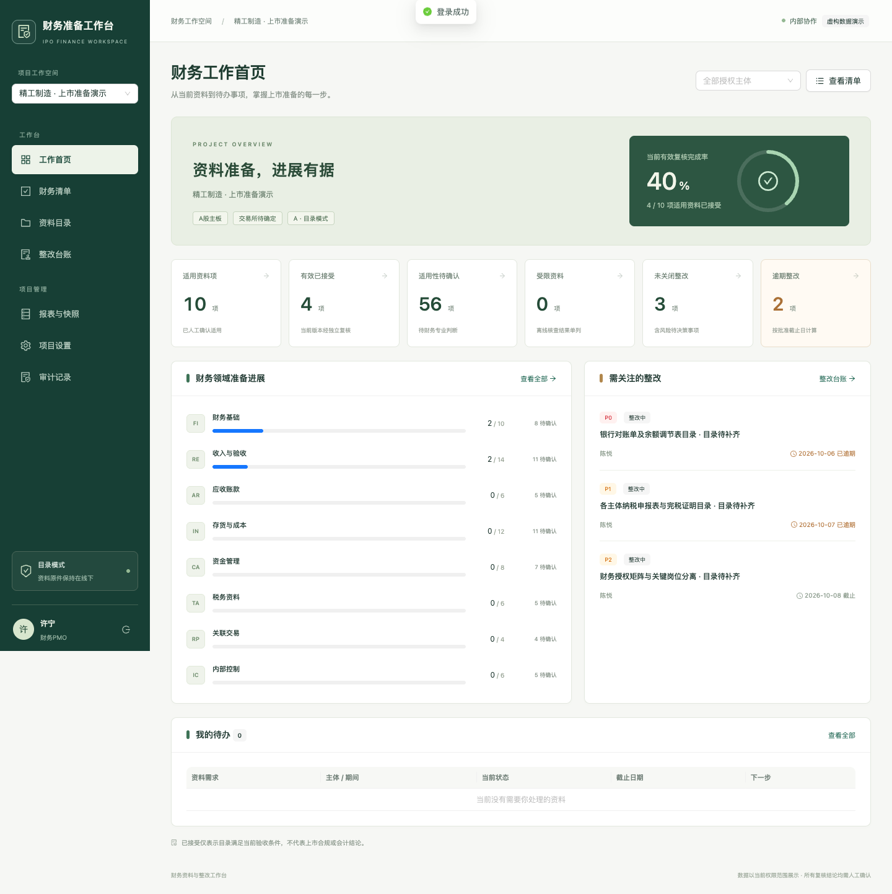
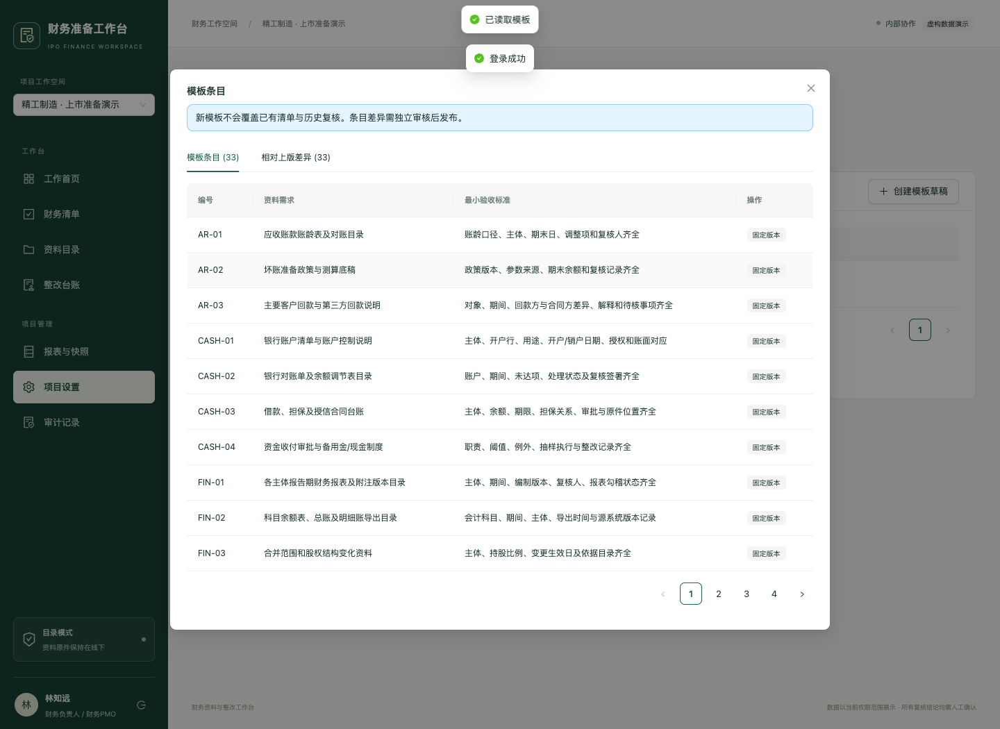

# 第一阶段开发交付记录

版本：开发版 V0.1。记录日期：2026-10-08。依据：产品需求文档、上线部署手册、《技术适配声明》《第一阶段技术开发文档》。本次开发前已全文阅读后两份文档，共 777 行。

## 1 当前交付状态

已完成可运行的本地目录业务版本与自动化验证。源文件、依赖锁、迁移、种子、接口契约、测试、运行说明及内网部署定义已落地。仅使用虚构数据，未上线公司内网或公网，也未连接真实用友、原件库或模型服务。

**“开发实现”“自动测试”“内网部署”“业务验收”分别记录。此版本不等于第一阶段正式验收完成。**

| 工作包 | 本次状态 | 可核验内容 |
| --- | --- | --- |
| M0 基线与准入 | 开发范围明确；公司实际准入待完成 | 本次固定 A 模式、人工复核及虚构数据；未代签公司批准 |
| M1 底座 | 已实现并自动测试 | 账号会话、CSRF、授权、PostgreSQL 迁移、审计与历史保护 |
| M2 项目清单 | 已实现主要闭环并测试 | 主体期间、33 项种子、模板差异、独立发布、生成预检、适用性、分派 |
| M3 目录复核 | 已实现并测试 | 字段白名单、固定版本、独立接受/退回、受限离线核查、换版失效 |
| M4 整改管理 | 已实现主要闭环并测试 | 缺口、行动、延期、独立关闭、重开、看板、冻结快照、批准导出、工时 |
| M5 内网交付 | 已准备定义；尚未部署或签收 | 本地容量与冷备恢复已测，目标内网环境及正式运维验收待开展 |

## 2 实现的关键控制

- 真实 PostgreSQL 18.4；应用 `finance_app` 不是超级用户，不拥有删表、删除业务历史或变更模式的权限。迁移使用另一账号。
- 会话 Cookie 为 HttpOnly、SameSite=Strict；生产启用 Secure。写请求检查精确 Origin 与 CSRF，空闲 30 分钟、最长 8 小时。初始密码必须修改；连续失败限制登录。
- 按项目、主体、角色及对象分派查询。统计先过滤当前权限；身份管理员不自动获得已有财务项目权限。
- `person_id` 唯一，且复核、模板发布、准入验证、审批及整改关闭执行职责分离校验。
- 关键成功审计与业务变更同一数据库事务；审计不可写时业务回滚。记录 trace_id，不记录密码、原件或请求正文。
- 目录、提交引用、复核、范围版本、整改行动、快照及审计历史有追加保护；已发布模板另有数据库触发器保护。数据库超级管理员仍需公司的独立运维控制。
- 请求幂等、业务唯一约束和项目事务锁共同防止重复及并发覆盖。批量分派逐行返回结果，合法行可提交。
- 快照保存冻结内容及 manifest SHA-256。导出批准绑定快照，CSV 单元格处理公式前缀；产物不放在静态目录。任务启动、查看与下载均重验权限及准入。
- 原件、AI 路径拒绝；开启上传、AI 或关闭必要审计的配置会导致启动校验失败。运行不调用模型服务。

## 3 相对设计草案的实现选择

| 原设计或示例 | 本次实现及影响 |
| --- | --- |
| Docker PostgreSQL | 本机没有 Docker，开发使用 embedded-postgres 提供的原生 PostgreSQL；并非内存库或 SQLite。内网仍按批准的数据库环境部署 |
| 快照拟用 Repeatable Read | 采用所有业务写入、权限变更、worker 和快照共用的项目级事务锁，以当前小团队规模保证业务写入序列一致；其他直接数据库写入必须受运维控制 |
| worker 租约 | 单次执行在持锁数据库事务内；进程中断回滚到 queued，可重新执行。没有提交后悬挂的“运行中”租约状态 |
| 复核 checks 对象示例 | 当前契约为检查点字符串数组，必须覆盖固定模板全部检查点；以 `docs/openapi.json` 为实际协议 |
| 状态与业务命令分组 | 部分路径采用 `/{id}/{action}`，具体允许命令由后端白名单控制；不能直接写 accepted、closed 等状态字段 |
| 目录跨主体/跨期 | 本版每个目录绑定一个主体及期间；复杂组合需拆分目录后分别关联，不自动跨范围引用 |
| 模板版本更新 | 编辑草稿并查看相对上版差异，独立发布；重复生成保留已有清单绑定的模板与复核。已有实例迁移至新标准的专门审批界面尚未实现 |
| API 默认端口 | 本地改为 18080，避免占用已有服务；前端统一经 5173 的 `/api` 代理访问 |
| 本地备份演练 | 本机依赖包不含 pg_dump，采用干净关闭后的集群物理副本验证恢复。正式不停机逻辑备份与异地复制由目标 IT 环境落实 |

本次没有改写原 PRD、上线手册或两份设计草案来掩盖差异。

## 4 验证记录

| 验证 | 结果 | 范围及限制 |
| --- | --- | --- |
| TypeScript 与 Vite 构建 | 通过 | 生成 `frontend/dist/`；不是容器镜像构建 |
| PostgreSQL 集成测试 | 28 项通过 | `backend/tests/`，独立 finance_test，含容量场景 |
| 浏览器回归 | 4 项通过 | 本机 Chrome，真实页面、API、中文表单和权限检查 |
| 全新数据库迁移 | 通过 | 空 finance_restore 从冻结 SQL 升级至 0002，并安装不可变历史触发器 |
| 容量 | 通过本机目标 | 10 个活动账号、5 人并发、2,112 项清单、10,000 条目录；100 次混合请求 P95 **161.83 ms**、最大 **163.99 ms** |
| 冷备隔离恢复 | 通过本机校验 | **2.56 秒**；表记录数量、快照摘要、外键引用一致，恢复副本撤销 19 个旧会话 |
| 外联观察 | 已检查路径未发现外联 | 浏览器测试覆盖登录及主要业务页；不等同目标网络已完成出站阻断验收 |
| 页面视觉检查 | 通过桌面尺寸检查 | 1440 像素宽看板及模板弹窗截图；未进行完整无障碍或全部移动设备验收 |

性能测试使用 TestClient 驱动真实 API 和数据库，不包含生产网络、TLS、终端浏览器渲染与长期负载，不能据此承诺生产 SLA。恢复为同机同盘演练，不是独立故障域备份，不代表正式 RPO/RTO 已获批准。原始结果保存在 `.runtime/capacity-results.json`、`e2e-results.json`、`recovery-results.json` 和 `migration-results.json`；本目录 `validation/` 保存本次可共享结果副本。

自动测试对应的重点：TC01/02 的通用候选和重复生成；TC04 不适用理由与独立批准；TC05/15/18 禁用及授权拒绝路径；TC08/09 同人分离与换版；TC11 受限核查；TC12/13 整改独立关闭与两次延期；TC14/ ST11 冻结内容、重复导出与撤权；ST01/03/05/06/08/12/13/16/17/18 并发、非法写入、审计回滚、幂等、零分母、安全显示、会话、部分成功、负收益和配置限制。

FIN-01、FIN-02、REV-03、REV-04、REV-07、AR-01、INV-02、CASH-02、TAX-01、IC-01 共十类在两个主体间完成目录和独立复核测试。缺件、主体期间不符、审批依据缺失三类缺口完成提交验证、独立关闭及重开测试。worker 中断采用提交前异常模拟，证明事务回滚和再次执行不重复；未进行操作系统断电级故障注入。保留一条 Starlette TestClient 的 httpx 弃用提示，目前不影响测试通过。

## 5 仍需完成的工作

以下不是已验收能力，继续开发及试点时应保留：

1. 公司实名账号分工、实际项目主体期间、目标交易所、字段白名单和真实目录准入依据的业务确认。
2. 账号创建/停用目前有 API 与首位管理员初始化工具，完整身份管理页面、人员移交及密码找回尚待补齐；个人视图已有保存/查询 API，页面管理尚待完善。
3. 模板已有实例升级审批、复杂业务标签条件及大规模范围变更的逐项影响确认。当前未知条件保持人工待确认，不自动输出监管合规判断。
4. 导出到期物理文件清理、失败临时文件/孤儿文件巡检、worker 非业务异常告警和有界重试治理；当前文件受鉴权和过期校验保护，未配置自动清理业务历史。
5. 更完整的服务端目录分页、整改分页、操作审计筛选与效率样本不足展示；当前大列表部分由浏览器分页，已有容量测量不替代持续优化。
6. 公司环境的 Docker 镜像构建与摘要、漏洞和许可证审查、证书、网络出站限制、独立备份、备份失败告警、磁盘加密、保留周期与灾难恢复演练。
7. 财务 Owner 业务验收、IT 运维验收和正式试点发布。当前未获得、也未代替这些签字。

PRD TC06 原件重复哈希、TC07 扫描质量、TC16 Excel 迁移、TC17 AI 候选采纳仍后置；用友导入/直连、OCR、模型分析、自动提醒、原件 B/C 模式保持关闭。不能把本次拒绝路径测试计作这些能力已完成。

## 6 页面预览

模板弹窗增加最终透明度断言后完成截图复核，避免将打开动画的过渡帧作为显示结果。

