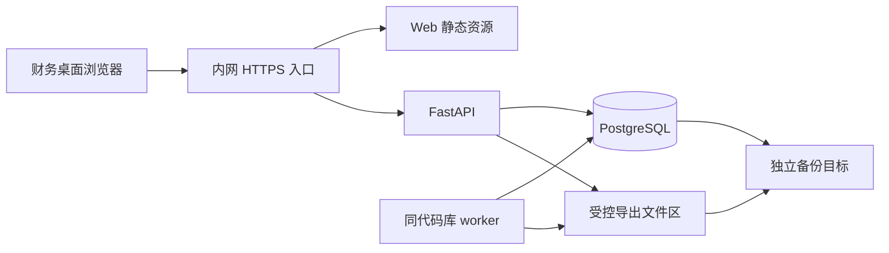

# 第一阶段技术开发文档

> 2026-10-08 已按用户指令进入开发。本文保留 V0.2 设计基线，实际完成项、测试与剩余差异见 [开发实施记录](docs/开发实施记录.md)，不以方案中的预期功能代替验收结果。
项目为 A股主板IPO财务资料与整改工作台。阶段名称为目录模式下的财务业务闭环。版本 V0.2，编制日期 2026-10-08，状态为待评审的开发设计。

本阶段让财务人员按主体和期间生成清单、登记获准目录，由另一位人员复核，并将缺口转成有证据和独立验证的整改事项。第一条业务链路采用最小真实页面与后端共同验证，之后扩展管理看板和受控导出。

配套依据为[产品需求文档](<A股主板IPO财务资料与整改工作台 产品需求文档.md>)、[技术适配声明](<技术适配声明.md>)及[通用技术栈手册](<AI产品Vibe Coding通用技术栈手册(1).md>)。本轮只编制文档，以下目录、接口、配置及测试均是后续实施契约，未创建应用代码或执行应用验收。

## 一 阶段目标

### 1 交付范围与 PRD 对应关系

| PRD 要求 | 本阶段交付 | 后置内容 |
| --- | --- | --- |
| F01 项目及范围 | 主体、期间、画像、范围版本、交易所待决事项 | 未提供正式范围时只使用虚构项目 |
| F02 清单 | 生成预检、幂等生成、三值适用性、独立不适用审批、批量分派、拆分口径、个人视图 | 模型判断适用性 |
| F03 资料及版本 | A 目录、准入字段白名单、不可覆盖元数据版本、多清单引用 | B/C 原件接收、预览、哈希去重、扫描质量检查 |
| F04 复核 | 固定版本提交、独立接受或退回、换版重核、受限离线核查 | 在线原件核验 |
| F05 整改 | 缺口、多对多归并、行动、严重性、延期、独立验证、重开 | 外部部门账号参与 |
| F06 看板 | 六类指标、风险分布、我的待办、按周快照趋势、快照与实时差异 | 自动消息推送 |
| F07 报表 | 冻结快照、审批、XLSX 与 manifest 导出、效率样本与收益口径 | 原件包及外部自动发送 |
| F08 AI | 上传与 AI 禁用边界 | OCR、模型、候选确认、向量检索和全文索引 |
| F09 模板 | PRD 33 项草稿种子、独立发布、来源版本、差异评估及旧实例受控升级 | 自动抓取监管规则 |
| F10 导入与提醒 | 页面内查询待办 | 旧 Excel 迁移、批次撤销及 7/3/1 天自动提醒 |

本阶段不代表完整 V1.0 P0 原件能力已经交付。适用于目录路径的测试必须通过，原件和 AI 用例保留为后置项。PRD 的 12 周为参考节奏，本文件不承诺交付日期。

### 2 主链路和完成条件

财务 PMO 建立范围及模板草稿，经独立发布后生成候选清单。确认适用性、分派经办与复核人后，经办登记目录版本并提交。独立复核人接受、退回或登记受限核查；缺口进入整改，Owner 提交行动及证据，由另一人验证。CFO 查看可下钻进度，PMO 申请获批范围的快照导出。

阶段交付包括源码、依赖锁、迁移、API 契约、虚构样本、自动化结果、内网交付定义、启动说明和业务验收清单。正式试点还需要获准目录、实名分工、目标环境恢复演练和财务及 IT 验收记录。

至少十个代表实例形成“清单、目录、独立复核”闭环，至少三类缺口完成独立整改验证。人员分离、越权、准入、审计、版本和恢复问题属于阻断项，不能用页面可打开代替验收。

## 二 技术适配摘要

采用模块化单体，后端处理可复用业务规则。桌面 Web 为唯一主要终端，前端使用 React、TypeScript、Vite 和 Ant Design，后端使用 Python、FastAPI、Pydantic，数据采用 PostgreSQL、SQLAlchemy 和 Alembic。以数据库任务表和单 worker 处理生成、快照及导出任务。

选择纵向切片的原因是人员确认、资料关联和版本复核属于核心业务。先交付一条可以操作和独立调用 API 的链路，再逐项补齐其他能力。页面沿同一前端扩展，不另建一套正式功能相同的临时界面。

| 适配点 | 本阶段结论 |
| --- | --- |
| Python 与 Node 版本 | 拟沿用本机及历史环境方向，Python 3.14.x、Node 24.x，开发时验证并锁定 |
| Next.js 与 Tailwind 默认方案 | 改用历史项目的 Vite 与 Ant Design，适合静态交付和财务表格表单 |
| SQLite 默认起点 | 直接使用 PostgreSQL，真实集成测试覆盖事务和约束 |
| 模型双层验收 | 无模型调用，真实模型冒烟不适用；工程与业务测试照常执行 |
| 云端部署 | 使用公司批准的内网环境，不建立公网业务入口 |
| 历史实现 | 保留可复用设计；恢复与迁移先核对源码和数据，旧测试记录不转记为本次通过 |

旧交付记录中的账号管理页面、服务端分页、模板实例升级、导出清理、任务恢复和告警等缺项，均纳入本阶段设计。是否复用历史实现由后续代码差异核对决定。

## 三 技术栈与模型

### 1 组件与职责

| 组件 | 目标选择 | 职责及版本处理 |
| --- | --- | --- |
| 运行时 | Python 3.14.x、Node 24.x、npm | 本机观察值为 3.14.7、24.18.0、11.16.0；不据此声明目标内网兼容 |
| HTTP 服务 | FastAPI、Uvicorn、Pydantic | 路由、请求响应模型、配置与统一错误；版本在兼容验证后锁定 |
| 关系存储 | PostgreSQL 18.x、psycopg、SQLAlchemy、Alembic | 持久化、外键、唯一约束、事务与数据库迁移 |
| Web | React、TypeScript、Vite、Ant Design、React Router | 可复用页面、中文表单、表格、路由和状态展示 |
| Excel 产物 | openpyxl | 生成获批字段的 XLSX；与 manifest 一起打包，不读取任意用户工作簿 |
| 登录 | Argon2id 密码哈希、数据库会话 | 独立账号、人员身份、会话到期与撤销 |
| 后台任务 | 同代码库 worker 与 PostgreSQL 任务表 | 参数快照、租约、恢复、重试和行级结果 |
| 检查与测试 | pytest、HTTPX、Playwright、ESLint、TypeScript | 逻辑、真实数据库、接口、页面与静态检查 |
| 内网交付 | Linux、Docker Compose、内部反向代理 | 前端静态资源、同源 API、独立持久卷和受控运行配置 |

Vite 可输出静态托管产物，因此内网前端由反向代理直接提供；FastAPI 使用自行构建的应用镜像。具体运行参数在目标环境验证后写入交付记录。[Vite 构建说明](https://vite.dev/guide/build)、[FastAPI 容器说明](https://fastapi.tiangolo.com/deployment/docker/)

### 2 模型和 Prompt 的处理

模型厂商、模型名、模型 Key、Embedding、OCR 和 Prompt 均为本阶段不适用项。不安装占位模型调用链路，不通过 mock 假装完成 AI 功能。模板条件、统计和状态流转由确定性代码实现。

### 3 版本固定原则

先核对历史锁文件与目标环境，再做一次依赖安装、构建及集成验证。通过后固定精确依赖和镜像摘要，后端保留一种依赖管理方式，前端统一 npm 锁文件。新增 ESLint 和 openpyxl 记录用途及版本，不顺带升级其他核心依赖。历史依赖号只是复用起点，安全、许可证和目标环境适配在交付前重新检查。

## 四 环境与配置

### 1 当前观察与环境隔离

当前工作区无应用代码和运行目录。本机可以调用 Python、Node、npm 和 Git，PATH 未找到 Docker 或 psql。`127.0.0.1:55432` 存在 PostgreSQL 监听，本轮未连接它，也未判断其数据归属。

后续拟使用前端 5173、API 18080、独立开发数据库 55434，仅监听本机。启动前再次检查占用，不能停止其他服务来释放端口。通过同源 `/api` 代理访问后端，避免页面保存数据库地址。

| 环境 | 数据和权限 | 隔离要求 |
| --- | --- | --- |
| 本地开发 | 虚构项目、人员和目录 | 独立 `finance_phase1_dev` 数据库，专用随机凭据 |
| 自动化测试 | 可重复的虚构边界样本 | 独立 `finance_phase1_test`；测试入口严格拒绝其他库名 |
| 隔离恢复演练 | 指定获准备份或虚构备份 | 独立恢复库、端口及文件区，禁止接入业务入口 |
| 内网验收及生产 | 公司批准的目录和实名账号 | 账号、秘密、数据卷、备份及入口与开发隔离 |

本机若需补齐运行环境，在开发启动时安装并验证。历史 embedded-postgres 仅可作为重新评估的本机开发方式，正式交付采用获准 PostgreSQL。未明确原数据库归属和备份前，不执行初始化、迁移或恢复。

### 2 运行配置契约

| 配置 | 示例或默认建议 | 验证规则 |
| --- | --- | --- |
| `APP_ENV` | `development` | 生产禁止演示账号和隐式种子初始化 |
| `APP_ORIGIN`、`TRUSTED_HOSTS` | 本地入口，生产改为批准域名 | 精确匹配；生产 HTTPS，不允许任意来源 |
| `DATABASE_URL` | 由受控配置注入 | 必填，应用身份无超级用户或模式管理权 |
| `MIGRATION_DATABASE_URL` | 仅迁移进程持有 | 不注入常驻 API、worker 或浏览器 |
| `DIRECTORY_ONLY` | `true` | 本阶段设为 false 则启动失败 |
| `UPLOAD_ENABLED`、`AI_ENABLED` | `false` | 本阶段任一设为 true 则启动失败 |
| `AUDIT_REQUIRED` | `true` | 不允许通过配置绕过必要审计 |
| `EXPORT_STORAGE_ROOT` | 开发可用 `.runtime/phase1/exports` | 生产使用受控持久卷，禁止静态直出和用户指定绝对路径 |
| `EXPORT_TTL_HOURS` | 暂定 24 | 正数，实际下载有效期受审批到期时间进一步限制 |
| `SESSION_IDLE_MINUTES`、`SESSION_MAX_HOURS` | 暂定 30、8 | 登出、重置密码、停用账号立即撤销旧会话 |
| `JOB_LEASE_SECONDS`、`JOB_HEARTBEAT_SECONDS` | 暂定 60、20 | 心跳小于租约；旧执行者失去租约后不得发布结果 |
| `JOB_MAX_ATTEMPTS` | 暂定 3 | 含首次执行，禁止无限重试 |
| `LOG_LEVEL` | `INFO` | 不记录请求正文、密码、Cookie、目录自由文本 |

以上时间参数是设计建议，测试及公司策略确认后冻结。生产启动校验检查配置键名与值的合法性，报错不回显秘密。

后续 `.env.example` 只列键名、注释和非敏感默认值，数据库连接留空。真实 `.env`、凭据、数据库、导出和备份须排除出 Git、镜像与前端构建。模型 Key 无需提供。

### 3 账号与准入输入

本地开发使用明确标注的虚构数据。真实试点前提供主体与期间、人员名单、经办及复核分工、目录字段准入依据、内部入口、证书、备份目标和运维责任人。通过公司受控方式提供部署秘密，不要求在聊天中粘贴密码。

## 五 项目结构

以下结构说明后续文件职责，本轮不创建代码目录。恢复历史代码时优先保留合理结构，按职责补齐即可。

```text
backend/
  app/api/               身份 项目 清单 目录 复核 整改 报表接口
  app/models/            表结构与关系
  app/schemas/           输入 输出及版本化结构
  app/services/          业务命令 查询 权限 准入和统计
  app/core/              配置 会话 错误和审计
  app/workers/           持久任务与导出清理
  app/main.py            应用入口
  migrations/            可审查数据库迁移
  tests/                 单元 权限 集成和恢复验证
  requirements.lock      锁定依赖
frontend/
  src/pages/             PRD 页面和业务切片
  src/features/          清单 目录 复核 整改交互
  src/shared/            API 客户端 筛选 表格和错误组件
tests/e2e/               真实浏览器与多人员操作
deploy/                  内网镜像 代理及持久卷定义
scripts/                 启动 备份 恢复与验证入口
docs/                    OpenAPI 数据字典 运维及验收记录
.runtime/                本地运行资料 不进版本控制
README.md                实际启动 操作和验证方法
```



## 六 数据 资产与状态

### 1 通用数据规则

关系数据库是业务事实及任务状态的持久来源。内部 ID 使用 UUID；业务编号单独生成。审计时间使用 `timestamptz`，统一存 UTC，界面使用 `Asia/Shanghai`。截止日使用 `date`，上海日期晚于该日且对象未完成即为逾期。报告期间起止日期包含边界，重叠区间给出提示并要求说明，不自动拒绝合法重叠。

可变记录包含 `row_version bigint`、创建与更新人员、时间；命令携带 `expected_version`。不可变记录追加新行，不通过修改旧行更正。结构化元数据、条件、快照和 manifest 各有 `schema_version`；字段类型、默认值及迁移由 Alembic 管理。

除下表标为可空的字段外，业务必填项写入前必须齐全。初建清单及待分派整改的人员和日期可空，提交复核或开始执行前必须满足相应守卫。关联均用外键，关键完整性不依赖自由 JSON。

### 2 核心实体与关键字段

| 实体 | 关键字段和类型 | 关系及约束 |
| --- | --- | --- |
| `person`、`user_account` | 人员 ID、账号 ID；用户名 varchar；密码哈希 text；状态 enum | 稳定人员 ID，正常配置一人一个活动业务账号；停用保留历史 |
| `session` | token_hash char(64)；user_id UUID；issued_at、last_seen_at、expires_at、revoked_at timestamptz | 撤销时间可空；不存明文令牌 |
| `membership`、`object_grant` | 项目、人员、主体 UUID；角色及动作 enum；有效期 timestamptz | 项目、主体和对象范围共同约束访问；授权者不能超出可授予范围 |
| `security_guard`、`project_guard` | 控制行 ID；project_id UUID；revision bigint | 为身份撤销、项目授权及业务事务提供统一锁入口；修订号用于失效检测 |
| `project`、`organization`、`period` | 项目 ID；主体代码 varchar(64)、别名；期间起止 date；交易所 enum | 正式主体代码在项目内唯一；主发行主体必须选定；演示代号另加标记 |
| `project_scope_version` | project_id UUID；version int；画像 jsonb；主体期间关系表；决定人 UUID | 画像有 schema 和字段白名单，三值业务标签允许 unknown |
| `template_version`、`template_item_version` | 稳定主题 ID、版本 ID UUID；code varchar(32)；来源、条件、验收点 jsonb | 每个项目独立管理模板版本；发布后不可改写；来源包含类型、版本、章节及审阅日期 |
| `template_change` | 新旧版本 UUID；变化类型 enum；目标清单 UUID；评估决定、人员和时间 | 每项差异可单独评估，不能自动套用新条件 |
| `checklist_item` | project、stable_item、org、period UUID；basis_key varchar(64)；适用性和进度 enum；人员 UUID、due_date date 可空 | 唯一组合为项目、稳定主题、主体、期间、口径；不包含模板版本和范围版本 |
| `personal_view` | person_id、project_id UUID；page、name varchar；filter_spec jsonb | 只保存筛选和排序，不保存业务数据副本；只能修改本人视图 |
| `applicability_proposal` | item_id UUID；目标值 enum；理由 varchar(1000)；提议和批准人员 UUID；状态 enum | 批准人和批准时间在待批时可空；不适用必须独立批准 |
| `admission_policy` | 依据编号 varchar(128)；项目主体 UUID；允许字段及动作 jsonb；用途；起止时间；状态；登记和核验人员 | 记录公司已有批准事实，不能自动产生涉密认定；正式激活需有效核验 |
| `evidence` | project、org、period UUID；code varchar(64)；mode enum；current_version_id UUID | 本期 mode 只能为 A；每份目录绑定一个主体和期间，复杂覆盖拆分登记 |
| `evidence_version` | evidence_id UUID；version int；schema_version int；metadata jsonb；metadata_hash char(64)；policy_id UUID；submitted_by UUID | 版本号在逻辑资料内唯一；不可覆盖；本期没有原件路径或 file_hash |
| `checklist_evidence_link` | item、evidence、selected_version UUID；active bool；版本号 | 一份目录可供多项引用，目标主体期间和口径覆盖必须匹配；变更留历史 |
| `submission`、`submission_ref` | 清单、模板版本、提交人 UUID；固定资料版本集合；submitted_at | 固定本次验收标准与证据，不能只保存当前版本指针 |
| `review`、`review_ref` | submission_id UUID；decision enum；checks jsonb；理由；复核人和时间；证据版本集合 | 复核结果追加写入；必须覆盖全部验收点 |
| `offline_verification` | 清单、目录版本、准入依据 UUID；核查方式、日期、获准代号及结论 | 不接收原件或任意原文；核查人与提交人员分离 |
| `gap`、`issue_gap` | 来源清单、复核、版本 UUID；类型 enum；事实 varchar(2000)；整改关联 | 缺口和整改多对多；归并保留来源事实 |
| `issue` | severity、state enum；Owner、verifier UUID 可空；original_due、current_due date 可空；extension_count int | 首次正式分派后原截止日固定；延期次数非负；改派不清除历史参与人员 |
| `issue_action`、`issue_evidence_ref` | issue_id UUID；action_result varchar(2000)；执行人；证据类型及固定引用；时间 | 证据为目录版本或离线核查记录，两种外键只能填一种；行动及证据追加保存 |
| `extension_request`、`issue_verification` | issue_id UUID；决定 enum；申请和决定人员；日期；原因和验证结论 | 延期申请与批准分离；整改验证检查全过程参与人员 |
| `snapshot`、`snapshot_entry` | 范围、模板和指标版本；as_of；冻结行 jsonb；manifest_hash char(64) | 冻结内容不可变；包含当时字段值及版本引用 |
| `export_request`、`export_artifact` | snapshot_id；spec_hash；用途；批准信息；路径；artifact_hash；expires_at | 产物只在批准后生成；下载期限不超过审批期限 |
| `metric_sample` | type enum；subject/period；duration_minutes numeric(12,2)；task_count int；phase enum；来源事件；版本 | 单条工时和完成量非负；净节省允许为负；更正留版本 |
| `job`、`job_row` | kind、state enum；params jsonb；总数及进度；attempt int；lease_until；attempt_token UUID；result_ref | 参数冻结；行级键唯一；保留成功及失败明细 |
| `idempotency_record` | actor、operation、key；request_hash；result_ref；created_at | 作用域组合唯一；同键不同请求返回冲突 |
| `audit_event` | actor/person、object、action、result、time、trace_id、before/after_hash、approval_ref | 追加写入；不复制目录原文、客户名称或金额 |

开发时据此补齐逐字段 schema、索引和 OpenAPI，不能省略上表的约束。清单和整改建立项目、主体、期间、状态、经办及截止日索引；版本按逻辑资料和版本号索引；任务按状态、下次重试时间和租约索引。所有列表在服务端过滤后分页，避免加载全部数据到浏览器。

### 3 种子 模板与范围变更

33 项种子来自 PRD 4.2，包含 FIN 5 项、REV 7 项、AR 3 项、INV 6 项、CASH 4 项、TAX 3 项、RP 2 项、IC 3 项。主题编号、用途和验收标准按原文迁入草稿，岗位建议不能变成真实人员分派。系统安装不等于财务批准模板，演示发布版本须标为虚构用途。

模板状态为 `draft / in_review / published / retired`。独立审核人批准发布；来源失效标为待复核。条件只支持白名单字段、显式运算符及真、假、未知三值结果，不执行用户表达式代码。条件输出只形成建议，不能自动成为人工适用性决定。

新模板发布生成新增、条件变化、验收条件变化、来源变化及废止建议。重复清单生成不改变旧实例所绑定标准。旧实例升级由有权专业复核人逐项决定，保留旧标准；决定采用新标准时写入升级事件，已接受项进入待重核。废止建议只归档实例，不删除复核或整改。

范围修改先预览新增、退出及受影响对象，CFO 批准后形成范围版本。退出范围的实例标记 `in_current_scope=false`，旧历史和未关闭整改继续保留；首页另列仍需处理的退出范围整改。交易所由未知改为确定时产生差异待审，不重置原结论。

### 4 目录准入与版本

A 模式候选字段包括批准代号、类型、主体、期间、保管部门、获准位置代号、取得状态、版本描述及准入编号。日期、凭证索引等附加字段须在准入白名单中明确允许。客户名称、金额、合同或图纸标题、任意附件 URL、Base64 原文不属于默认可填字段。

单个目录请求限制为 32 KiB，说明字段按 schema 限长；这是技术保护上限，不代表允许录入相同体量的业务原文。具体业务字段由公司准入约束。系统不声称能够自动识别全部敏感文本，误录处置采用隔离与保留审计的公司流程。

取得状态区分未收集、已定位、待取得、受限待核、无法取得、经核实不存在。后两项需要人工理由，不能自动改成不适用。A 模式 `metadata_hash` 只说明元数据内容摘要，不代表原件存在或真实。

新版目录必须提供替换原因。创建版本、调整引用和作出复核结论均在事务中检查当前版本。新版使相关当前接受或受限已核结论失效，旧提交与旧复核继续引用当时的固定版本。涉及已关闭整改时生成待评估标记，由验证人决定是否重开。

准入过期或撤销在每次读取、操作、统计和下载时立即生效，不等待后台补写状态。无权用户只能看到不泄露标题、代号和数量的通用提示；获授权管理者可看到允许披露的待处理状态。旧快照和任务 URL 也必须重新检查权限。

### 5 状态机与业务守卫

适用性使用 `pending / applicable / not_applicable`。适用由有权财务人员确认，保留理由。不适用需要提议与独立批准；存在未处理整改时先处理关联事项并记录决定，不能以排除分母隐藏未决问题。

| 资料进度 | 进入动作和前置条件 | 后续动作 |
| --- | --- | --- |
| `not_started` 未开始 | 新建候选 | 确认适用、分派后待收集 |
| `collecting` 待收集 | 已适用，任务分工合法 | 登记及关联目录后提交 |
| `submitted` 已提交 | 至少一份有效目录；人员、截止日齐全；冻结提交版本集合 | 复核人开始复核 |
| `reviewing` 复核中 | 指定复核人有效且与提交人员不同 | 接受、退回或受限核查 |
| `accepted` 已接受 | 验收点全部完成、范围及准入有效、版本未变、独立人员决定 | 新版或引用变化转待重核 |
| `returned` 退回补充 | 原因码及具体补充动作齐全 | 经办补充后重新提交 |
| `restricted_pending` 受限待核 | 当前要求须离线核查，有责任人与批准方式 | 独立核查后受限已核 |
| `restricted_verified` 受限已核 | 固定获准目录、核查方式和结论齐全 | 单列统计；依据变更转待重核 |
| `blocked` 阻塞 | 记录原因、责任人及待决动作 | 阻塞解除后回到明确允许状态 |
| `re_review` 待重新复核 | 当前依据、标准或准入有效性变化 | 补齐有效依据后重新提交 |

`accepted` 只表示该项目录准备要求已按标准独立复核，不能推导为上市条件成立或会计结论正确。受限已核不计入普通已接受率。未适用、准入失效或退出当前范围时，不能仅凭存储的旧状态计入完成分子。

整改状态使用 `unassigned / in_progress / pending_verification / closed / risk_decision`。分派后整改中，提交行动与有效证据后待验证；独立验证可以关闭或退回。无法按期完成转风险待决策，仍计入未关闭及逾期。关闭后可由验证人或获授权负责人说明原因重开。

整改关闭要求关键行动完成、阻塞解除、证据有效且验证结论完整。验证人不能是本事项任何实质整改行动的执行人或提交人，改派 Owner 不能绕过历史参与人检查。延期批准人不能是申请人；未批准的新日期不参与逾期计算。首次正式分派后固定原截止日，批准延期才改变当前截止日并累计次数。

### 6 事务 并发与审计

单个接受、不适用批准、延期批准、整改验证、模板发布和范围变更必须原子提交。状态、固定版本引用、成功审计和后续任务在同一事务中写入。任何一项失败则全部回滚。

本阶段采用统一顺序获取数据库锁，先身份安全控制行，再项目控制行，再按 ID 排序的业务对象。普通业务写入对项目控制行加排他锁；准入和项目授权变更遵循同一规则。全局账号停用或会话撤销对身份控制行加排他锁，普通请求采用共享锁。后端命令和 worker 统一经过这套入口，防止检查权限之后被另一事务撤销却继续提交。

目录、列表和看板在取得身份共享锁及项目共享锁后，于同一短事务内组装权限、总数与结果。受控下载只在鉴权及打开已发布文件的短事务内持锁，随后释放锁再传输，不让慢下载阻塞撤权。共享锁与业务写入的排他锁相互约束，保证一次响应的口径一致。

采用 Read Committed 并在取得控制锁后读取业务内容，项目内短事务序列执行。并发命令仍检查 `expected_version`，过期请求返回 409。快照冻结也持有同一项目控制锁；文件生成在事务外完成，避免文件 I/O 长期占锁。需要跨请求稳定对照时使用冻结快照，不能假定普通实时查询一直看到同一数据。PostgreSQL 的 Read Committed 按语句取得读取视图，因此本方案的一致性还依赖统一锁约束。[PostgreSQL 事务隔离说明](https://www.postgresql.org/docs/18/transaction-iso.html)

不同项目按 ID 顺序加锁；第一阶段不允许跨项目资料引用。锁等待和瞬时数据库冲突只能有限重试，不绕过权限或行版本检查。容量验证若发现项目锁造成瓶颈，再评估细化锁粒度并补充回归。

创建、提交、批准及长任务使用 `Idempotency-Key`，作用域包含人员、HTTP 方法、规范路径及业务参数。同键同载荷返回原结果引用，同键不同载荷返回 409。重放先检查当前权限，不返回已撤权对象内容。记录过期清理规则在真实留存策略明确后配置；业务唯一键和固定提交 ID 不依赖幂等记录永久存在。

批量分派和清单生成采用逐行事务，合法行提交，失败行返回原因；整个批次保留汇总。关键单项命令禁止部分成功。

审计记录登录、读取、搜索、拒绝、版本、适用性、复核、整改、延期、导出及权限变化。失败事件通过独立短事务记录，避免业务回滚一并删除。审计完全不可写时关键写入及业务内容下载返回 503，并产生不含业务内容的运维故障记录。应用账号无权更新或删除审计历史；数据库管理员仍需公司的独立运维控制。

### 7 可恢复任务与资产管理

任务类型限定为 `generate_checklist / create_snapshot / build_export / cleanup_export`。状态包含 `queued / running / retry_wait / succeeded / partially_succeeded / failed / cancelled`，终态保留原因及结果引用。

worker 用短事务领取任务、记录 `attempt_token` 和租约。执行前及每个业务提交点都重新核对发起人当前权限、准入、参数范围和租约。每 20 秒心跳，60 秒无续租允许回收；这些暂定值在故障测试中验证。旧 worker 的结果提交必须匹配当前 token，租约失效即拒绝，不能出现两个执行者覆盖同一产物。

生成任务保存逐行唯一键和检查点，重试跳过已成功行。最多执行三次，瞬时失败等待 5 秒、15 秒后重试；业务校验、权限失效和准入拒绝直接终止相应行或任务。再次人工重试须重新鉴权并保留原任务关联。

导出文件以任务及执行 token 命名写入受控临时目录，完成后校验哈希，在持有锁且再次鉴权的条件下发布。文件就绪后才提交可下载记录；进程在移动文件与数据库提交之间退出时，只留下不可公开访问的孤儿文件，由巡检清理或重新生成。数据库不得先标成功再去写文件。

下载过期立即阻止访问，后台清理只删除导出副本和失败临时文件，保留快照、审批、审计及哈希记录。磁盘错误、清理失败、任务连续失败或积压产生内部告警。界面显示任务进度、行级失败和重试入口，不显示内部路径。

## 七 API 与权限设计

### 1 身份与权限

人员 ID 由批准的实名人员映射建立，客户端不能通过填写新的人员编号规避自审。身份管理员可以开通和停用账号，项目业务权限由获授权的 CFO 或 PMO 分配；创建账号不自动取得财务内容权。首位管理员通过受控初始化建立，没有公共注册或默认生产密码。

密码采用 Argon2id，哈希参数在目标机器测试后固定；密码及临时凭据不进入业务日志。账号创建、重置密码和首次改密的交付渠道使用公司受控方式。[OWASP 密码存储指南](https://cheatsheetseries.owasp.org/cheatsheets/Password_Storage_Cheat_Sheet.html)

会话使用高熵随机 token，数据库只存摘要。生产 Cookie 设置 Secure、HttpOnly、SameSite=Strict，限制作用域；开发环回 HTTP 仅允许明确的开发配置。写操作校验 Origin 和 CSRF token，登录也校验来源并限速。登出、改密、停用及恢复后撤销旧会话。Cookie 属性不能代替完整的 CSRF 校验。[OWASP 会话指南](https://cheatsheetseries.owasp.org/cheatsheets/Session_Management_Cheat_Sheet.html)

每次请求依次核验身份、项目、主体、动作权限、对象分派、字段准入及状态守卫。列表先按权限过滤，再排序、计数和分页；看板、搜索、任务及导出复用同一策略。默认拒绝未声明的动作，客户端隐藏按钮只用于交互提示。[OWASP 授权指南](https://cheatsheetseries.owasp.org/cheatsheets/Authorization_Cheat_Sheet.html)

| 操作 | 业务资格 | 不可绕过的条件 |
| --- | --- | --- |
| 范围批准 | CFO 或明确授权人员 | 预览与批准参数一致，退出范围历史保留 |
| 模板发布及标准升级 | CFO 或指定专业复核人 | 发布人与草稿实质编辑人员集合分离；升级不覆盖旧标准 |
| 清单分派 | CFO 或 PMO | 人员当前有权，Owner 与复核人不同 |
| 不适用批准 | 获授权专业复核人 | 与提议人不同，理由具体，未决整改已有明确处理 |
| 目录与提交 | 获授权经办 | 仅 A 模式；有效字段白名单及覆盖范围 |
| 接受及离线核查 | 指定或获授权复核人 | 与本次提交人及引用版本提交人集合分离 |
| 整改验证 | 指定独立验证人 | 不属于该整改历次实质行动执行或提交人员 |
| 延期批准 | CFO 或授权审批人 | 申请人与批准人不同 |
| 导出申请及批准 | CFO 或获授权 PMO 申请，授权审批人批准 | 设计建议为独立批准，范围与字段冻结；按适配声明确认人员安排 |
| 日常运维 | IT 运维 | 不自动获得目录、报表或快照内容权限 |

人员停用后，未完成事项标为分派异常，由有权人员重新分派并留痕，不能删除历史人员。项目切换、登出、401 或撤权通知发生时，页面清理内存数据；业务响应使用 `Cache-Control: no-store`，不保存业务内容到离线缓存或浏览器持久存储。

### 2 公共接口约定

API 前缀固定为 `/api/v1`，以下表格省略该前缀。JSON 请求采用 UTF-8，Pydantic 输入拒绝未知字段；响应有明确 DTO，数据库对象不直接透传。UUID、日期、枚举、字段长度、页大小和排序均校验。动作执行人和时间来自会话及服务器，不能由请求指定。

查询共用 `FilterSpec`，包含项目、主体、期间、领域、适用性、进度、严重性、Owner、复核人、截止范围、受限标记及当前范围标记。只允许各资源支持的字段；每页只能为 20、50 或 100，排序使用列白名单并追加稳定 ID 次序。列表响应为 `items / total / page / page_size`，其中 total 仅含当前有权结果。

成功返回 `data / as_of / trace_id`。创建返回 201，普通命令及部分成功批次返回 200，异步提交返回 202。批量结果另含 `succeeded / failed / rows`，每行含对象 ID、结果及错误码，不在顶层成功时隐藏行级失败。

错误统一返回以下结构，错误详情只包含获授权的字段名及必要冲突版本。

```json
{
  "error": {
    "code": "VERSION_CONFLICT",
    "message": "记录已更新，请刷新后比较差异",
    "details": {"current_version": 8}
  },
  "trace_id": "request-trace-id"
}
```

| HTTP 状态 | 错误码示例 | 处理 |
| --- | --- | --- |
| 401 | `UNAUTHENTICATED`、`SESSION_REVOKED` | 清理会话数据，重新登录 |
| 403 | `ACCESS_DENIED`、`SELF_REVIEW_FORBIDDEN`、`ADMISSION_INVALID`、`FEATURE_DISABLED` | 说明允许的后续动作，不披露无权对象 |
| 404 | `NOT_FOUND` | 普通无权对象与不存在对象可用一致提示 |
| 409 | `VERSION_CONFLICT`、`IDEMPOTENCY_CONFLICT`、`INVALID_TRANSITION`、`PREVIEW_STALE`、`EVIDENCE_VERSION_CHANGED` | 刷新、重新预检或重新提交，不自动覆盖 |
| 413 | `PAYLOAD_TOO_LARGE` | 告知技术长度限制，不接收超限正文 |
| 422 | `VALIDATION_ERROR`、`FIELD_NOT_ALLOWED`、`CHECKS_INCOMPLETE` | 按字段显示错误，保留未提交的允许输入 |
| 429 | `RATE_LIMITED` | 告知重试时间 |
| 503 | `AUDIT_UNAVAILABLE`、`DEPENDENCY_UNAVAILABLE` | 明确动作未提交，保留 trace_id 供排查 |

业务写接口默认适用 CSRF、权限、版本及幂等约定。创建命令没有旧版本时无需 `expected_version`，但仍需幂等键。登录、改密和凭据重置不保存含凭据的幂等请求或响应，按身份安全流程办理；重复登出保持撤销状态。只读预览保存参数摘要和依据版本；正式执行发现变化时返回 `PREVIEW_STALE`，不得沿用过期预估静默执行。

### 3 身份 项目与模板接口

| 方法和路径 | 关键输入 | 输出与额外守卫 |
| --- | --- | --- |
| `GET /auth/csrf` | 无 | 200，匿名或当前会话的 CSRF 引导 token，不返回业务数据 |
| `POST /auth/login` | username、password | 200，轮换 Cookie 和 CSRF 信息；通用登录失败提示 |
| `POST /auth/logout` | CSRF | 200，撤销服务端会话 |
| `GET /me` | 当前会话 | 200，人员、角色和可进入项目摘要 |
| `POST /auth/change-password` | current_password、new_password | 200，验证旧凭据并撤销旧会话 |
| `GET /users`、`POST /users` | 查询或 person_id、username | 200 列表或 201 账号；身份管理员可用，不给业务内容权 |
| `POST /users/{id}/disable`、`POST /users/{id}/reset-credential` | reason、expected_version | 200，立即撤销旧会话；返回受控办理结果，不输出日志中的临时密码 |
| `GET /projects`、`POST /projects` | 查询或 name、board、exchange | 200 列表或 201 项目；默认主板及交易所未知，限有创建资格人员 |
| `POST /projects/{id}/organizations` | code、name、aliases、is_demo | 201 主体；正式统一代码去重 |
| `POST /projects/{id}/periods` | start_date、end_date、overlap_reason | 201 期间；起止校验，重叠明确提示 |
| `GET /projects/{id}/settings` | 当前项目 | 200，当前范围、画像、人员授权及模板概况 |
| `POST /projects/{id}/scope-previews` | org_ids、period_ids、profile、exchange | 200，preview_id、摘要及新增退出影响 |
| `POST /projects/{id}/scope-versions` | preview_id、expected_version、approval_reason | 201，已批准范围版本；旧范围保留 |
| `GET /projects/{id}/memberships`、`POST /projects/{id}/memberships` | 查询或 person_id、org_ids、roles、actions | 200 列表或 201 授权；禁止越权授予 |
| `POST /memberships/{id}/revoke` | reason、expected_version | 200，撤权、分派异常及权限修订结果 |
| `GET /projects/{id}/templates` | 筛选 | 200，模板版本及来源状态 |
| `POST /projects/{id}/template-versions` | base_version_id 可空、items、sources、checks | 201 草稿；新增项标公司自定义或真实来源 |
| `PATCH /template-versions/{id}` | 草稿字段、expected_version | 200 草稿；仅 draft 可编辑，记录编辑人员 |
| `POST /template-versions/{id}/submit-review`、`POST /template-versions/{id}/publish` | expected_version、reason | 200，提交评审或独立发布；检查点和来源信息完整 |
| `POST /template-versions/{id}/return-review`、`POST /template-versions/{id}/retire` | expected_version、reason | 200，退回草稿或废止；已发布内容及旧实例引用保留 |
| `DELETE /template-versions/{id}` | expected_version | 200，仅允许未发布、无业务引用的草稿；删除动作留审计 |
| `GET /template-versions/{id}/changes` | page、page_size | 200，新增、条件、来源、标准和废止建议 |
| `POST /template-changes/{id}/decisions` | adopt 或 retain、reason、expected_version | 200，逐项决定；采用新标准触发重核，保留旧记录 |

### 4 清单 目录与复核接口

| 方法和路径 | 关键输入 | 输出与额外守卫 |
| --- | --- | --- |
| `POST /projects/{id}/checklist-previews` | scope_version_id、template_version_id、basis_key | 200，新增、已存在、条件未知和冲突数量及 preview_id |
| `POST /projects/{id}/checklist-jobs` | preview_id、request_hash | 202，job_id；执行时复验范围及模板 |
| `GET /projects/{id}/checklists`、`GET /checklists/{id}` | FilterSpec 或对象 ID | 200，列表或验收条件、当前引用、历史及缺口 |
| `POST /checklists/assignments` | rows 中逐项 item_id、expected_version、owner_id、reviewer_id、due_date | 200，逐行结果；不能自审及越权分派 |
| `POST /checklists/{id}/split` | 新主体、期间或口径、reason、expected_version | 201 新实例；重复唯一键拒绝，源实例历史保留 |
| `POST /checklists/{id}/applicability-proposals` | target、reason、expected_version | 201 提议；适用可由有权专业人员确认，不适用待独立批准 |
| `POST /applicability-proposals/{id}/decisions` | decision、reason、expected_version | 200，独立批准或退回；检查关联整改 |
| `POST /checklists/{id}/block`、`POST /checklists/{id}/unblock` | reason、resolution、expected_version | 200，阻塞记录或解除；恢复状态由后端守卫决定 |
| `GET /me/views`、`POST /me/views`、`PATCH /me/views/{id}` | page、name、filter_spec、sort | 200 列表或变更、201 新视图；仅本人可写 |
| `POST /projects/{id}/admission-policies` | 审批编号、项目主体、字段、用途、动作、有效期 | 201 待核验记录；不在系统生成保密认定 |
| `POST /admission-policies/{id}/verify`、`POST /admission-policies/{id}/revoke` | 公司授权依据、reason、expected_version | 200，激活或撤销；须为获授权核验人员 |
| `GET /projects/{id}/evidence`、`GET /evidence/{id}` | FilterSpec 或 ID | 200，目录列表或当前及历史版本摘要 |
| `GET /evidence/{id}/versions/{versionId}` | 固定版本 ID | 200，获准元数据和引用；旧版同样实时鉴权 |
| `POST /projects/{id}/evidence` | org_id、period_id、mode=A、policy_id、metadata | 201 逻辑目录及首版；未知字段拒绝 |
| `POST /evidence/{id}/versions` | policy_id、metadata、replacement_reason、expected_version | 201 新版及有权范围内的复核影响 |
| `POST /checklists/{id}/evidence-links` | evidence_version_id、coverage、expected_version | 201 引用；核对项目、主体、期间和允许范围 |
| `POST /evidence-links/{id}/deactivate` | reason、expected_version | 200，引用变更历史；相关有效结论重核 |
| `POST /checklists/{id}/submissions` | evidence_version_ids、expected_version | 201 固定提交；自动记录提交人和标准版本 |
| `POST /submissions/{id}/start-review` | expected_version | 200，复核中；指定人员及版本有效 |
| `POST /submissions/{id}/reviews` | accept 或 return、checks、reason_code、next_action、expected_version | 201 复核；接受检查全部点，退回须具体补充动作 |
| `POST /submissions/{id}/restricted-verification-requests` | policy_id、method、verification_person_id、reason、expected_version | 201 离线核查请求，进入受限待核；固定原提交与批准方式 |
| `POST /checklists/{id}/offline-verifications` | request_id、submission_id、evidence_version_ids、policy_id、method、date、conclusion、checks、expected_version | 201 受限核查；独立人员、固定版本和获准结论 |

复核 `checks` 使用结构化数组，每项为 `code / result / note`，result 限 confirmed 或 not_applicable。模板允许某检查点不适用时才可选 not_applicable，并填写说明。接受时必须覆盖全部要求；检查点数量及类型来自冻结模板版本，前端不能自行删项。

### 5 整改 报表与运维接口

| 方法和路径 | 关键输入 | 输出与额外守卫 |
| --- | --- | --- |
| `POST /checklists/{id}/gaps` | source_review_id 可空、version_ids、type、facts | 201 缺口，保存原始来源 |
| `GET /projects/{id}/issues`、`GET /issues/{id}` | FilterSpec 或 ID | 200，分页列表或完整时间线 |
| `POST /projects/{id}/issues` | gap_ids、facts、severity、owner_id、verifier_id、due_date | 201 整改；未分派字段可空，来源范围有权 |
| `POST /issues/{id}/assignments` | owner_id、verifier_id、due_date、reason、expected_version | 200，正式分派或改派；保留参与人员历史 |
| `POST /issues/{id}/gap-links` | gap_ids、reason、expected_version | 200，归并关联；不删原缺口和原关联历史 |
| `POST /issues/{id}/severity-decisions`、`POST /issues/{id}/risk-decisions` | severity 或处理决定、reason、expected_version | 200，调整及风险处理记录 |
| `POST /issues/{id}/actions` | result、milestone、blockers、evidence_refs | 201 行动结果和固定证据，支持目录版本或离线核查记录 |
| `POST /issues/{id}/submit-verification` | action_ids、evidence_refs、expected_version | 200 待验证；有结果、有效证据及合法验证人 |
| `POST /issues/{id}/verifications` | close 或 return、reason、expected_version | 201 独立验证；关闭须阻塞解除且无历史自审 |
| `POST /issues/{id}/reopen` | reason、new_evidence_ids、expected_version | 200 重开，保留原关闭记录 |
| `POST /issues/{id}/extension-requests` | requested_due、reason、impact、expected_version | 201 延期申请；当前逾期依据不变 |
| `POST /extension-requests/{id}/decisions` | approve 或 reject、reason、expected_version | 200，独立批准才修改当前截止日 |
| `GET /projects/{id}/dashboard` | FilterSpec | 200，分子分母、受限细分、风险、待办、as_of 及下钻筛选 |
| `GET /projects/{id}/snapshots`、`GET /snapshots/{id}` | 筛选或 ID | 200，快照列表或获权可见冻结内容 |
| `POST /projects/{id}/snapshot-jobs` | filter_spec、purpose、metric_version | 202，job_id；as_of 取实际冻结时间 |
| `GET /projects/{id}/export-previews` | snapshot_id、fields、report_type | 200，获准字段与范围预览，不包含无权数据 |
| `POST /snapshots/{id}/export-requests` | fields、purpose、report_type、preview_hash | 201 待批请求，绑定 export_spec_hash |
| `POST /export-requests/{id}/decisions` | decision、reason、expires_at、expected_version | 200，批准记录及 build_export job_id |
| `GET /exports/{id}/download` | 当前会话 | 200 ZIP 流；文件传输前重新核验当前范围、审批及有效期 |
| `GET /projects/{id}/metric-samples`、`POST /projects/{id}/metric-samples` | 分层或样本、来源、基线/试点、分钟数 | 200 列表或 201 样本；不把系统经过时间当人工工时 |
| `POST /metric-samples/{id}/corrections` | 新值、reason、expected_version | 201 样本修正版，旧版保留 |
| `GET /projects/{id}/efficiency` | 分层和时间范围 | 200，样本量、基线、试点、净工时及不足提示 |
| `GET /jobs/{id}`、`POST /jobs/{id}/retry` | ID 或 retry_reason | 200 状态或 202 关联重试；重新鉴权，逐行内容过滤 |
| `GET /projects/{id}/audit-events` | 对象、动作、时间、分页 | 200，获授权的审计摘要，不提供敏感请求正文 |
| `POST /evidence/uploads`、`GET /evidence/files/{id}`、`POST /ai/tasks` | 任意登录用户请求 | 403 FEATURE_DISABLED；解析文件前拒绝、不落盘、不入队 |
| `GET /health/live`、`GET /health/ready` | 内部运维访问 | 200 或 503，仅最小健康结果，不暴露配置和业务数量 |

健康端点不承担业务授权；生产 OpenAPI 和调试页面默认关闭或限定内网运维访问。离线 API 契约随交付包提供，不依赖公网 Swagger 静态资源。

`evidence_refs` 的每项使用 `kind / id`，kind 只能为 directory_version 或 offline_verification。服务端验证引用记录的固定版本、范围和准入，不能用不存在或已失效的离线核查记录申请关闭。

### 6 快照与导出契约

快照在第六节定义的项目事务保护下读取范围、模板、适用性、有效复核、整改及指标，将实际字段值与引用版本一起冻结。`as_of` 为实际冻结时刻，保留请求时间但不冒充冻结时间。任务成功前写入快照及审计，后续业务变更不改写冻结内容。

manifest 内容包括 schema、快照 ID、固定 as_of、范围版本、模板版本集合、指标版本、规范筛选、对象和元数据版本 ID、批准字段及冻结值。采用 UTF-8、固定键序、稳定数组排序、明确空值、ISO 日期及精确数字字符串生成规范 JSON，再计算 SHA-256。哈希值保存在外层，不把自身放进被哈希的内容。

快照 manifest 与具体导出规格摘要分别保存。同一快照、同一字段和格式规格生成相同 manifest；审批人、下载时间、临时路径不进入该内容摘要。XLSX 文件与 ZIP 的字节摘要另存 `artifact_hash`，不要求重新生成工作簿的 ZIP 时间戳天然一致。对同一有效产物重复下载返回同一文件。

导出包包含 `report.xlsx` 和 `manifest.json`。工作簿按报表类型输出目录、状态、整改、延期或效率数据，附范围、口径和截至时间。用户文本按显式文本写入，不能生成公式、宏、外部链接或可执行超链接；验证产物中没有用户输入形成的公式节点。openpyxl 用于创建和保存工作簿，具体安全编码由项目实现与测试保证。[openpyxl 工作簿教程](https://openpyxl.readthedocs.io/en/stable/tutorial.html)

批准绑定快照、字段、用途、导出规格、范围摘要和期限，任何变化重新申请。worker 生成及下载时分别核验当前权限；某个对象或字段撤权后拒绝原完整包，用户需以较小范围重新冻结和审批，不能删行后继续使用原哈希。

API 不发放绕过鉴权的永久直链。撤权后新的下载请求立即拒绝；已经交付给终端的字节和离线副本无法由本系统追回。快照可以保留历史事实，访问权仍按当前准入决定。

## 八 Prompt 设计

本阶段不调用模型，因此没有 Prompt、模型输出解析器、RAG 或 Agent 工具白名单。三值适用性、财务统计、任务重试及审批均由确定性代码处理。

后续 AI 阶段另建版本化 Prompt，采用 PRD 的候选结构，要求 file_version_id、来源页或行、置信信息及人工确认。届时需要同时完成结构校验、越权与注入测试、获批黄金集和内网真实模型冒烟。本阶段不以预留接口或拒绝测试代替 AI 质量验证。

## 九 最小界面与纵向切片

### 1 开发顺序

第一条切片只包含登录、一个虚构项目、一项适用清单、A 目录登记、经办提交及另一位人员复核。页面使用真实 API，刷新或服务重启后保留提交与结论。先验证自审拒绝和换版失效，再扩展到十类样本和 33 项模板。

第二条切片加入退回、缺口、整改行动与独立验证。第三条切片加入看板、快照和获批导出。每条切片通过对应业务与错误路径测试后，再扩展依赖它的页面。样式先满足清晰、可操作和错误恢复，正式视觉深化另行安排。

### 2 页面清单及交互上限

| 页面 | 本阶段内容 | 关键反馈 |
| --- | --- | --- |
| 登录及账号设置 | 登录、首次改密、人员开通停用、重置办理、角色和主体分配 | 通用失败提示，停用后旧会话立即无效 |
| P01 首页 | 六类指标、风险分布、我的待办、周度快照及与实时差异 | 每项统计可下钻，未知和零分母明确说明 |
| P02 清单列表 | 服务端分页、筛选排序、批量分派、个人视图、拆分口径 | 提交前预览，部分失败逐行解释 |
| P03 清单详情 | 标准、来源、适用性、目录引用、固定提交、复核与缺口 | 旧版结论与当前有效结论区分，显示下一步动作 |
| P04 目录登记 | A 模式准入、获准字段、范围、关联预览 | 无上传控件，先提示可填范围与长度 |
| P05 版本详情 | 当前及旧元数据、替换原因、固定复核引用和影响 | 新版导致重核时显示受影响项 |
| P06/P07 整改 | 列表、事实、行动、原现日期、延期、验证和重开时间线 | 自审及无证据关闭被拒，归并后仍能找回来源 |
| P09 项目设置 | 范围向导、模板编审、差异决定、准入核验、人员分工 | 未决交易所持续显示，已发布模板不可直接编辑 |
| P10 报表 | 快照、导出字段预览、审批、任务进度、下载和效率样本 | 撤权或过期给出可行动作，不泄露旧内容 |
| P08 AI 候选 | 本期不开放业务路由 | 设置中简要说明后续条件，不展示虚假候选 |

顶部固定项目、主体范围、报告期间、模板版本和数据截至时间。下钻继承筛选，并可清空。服务端数据变动造成卡片与新列表数不同，页面刷新卡片并显示新 as_of；严格复现使用同一快照。

加载中、无数据、没有权限、字段错误、版本冲突、网络中断和任务失败分别设计。变更未确认前不显示成功；断网恢复后使用原幂等键查询结果。人员切换后清空上一个账号数据。表格状态同时有文字和图标，键盘能完成主要操作。

目标为公司批准的桌面浏览器，验收检查 1280 和 1440 像素宽度及浏览器缩放。窄屏至少可读、可横向查看表格且不遮挡关键提示，完整手机操作不纳入本阶段主要终端验收。

### 3 看板和效率口径

| 指标 | 计算规则 | 边界 |
| --- | --- | --- |
| 适用项 | 当前范围、有权且人工确认适用的实例 | 未知、不适用分别展示 |
| 已接受率 | 当前有效且独立接受实例数除以适用项 | 版本或准入失效即扣回；零分母显示暂无可计算分母 |
| 责任覆盖率 | 有合法经办、复核人和截止日的适用项除以适用项 | 人员停用或授权失效不能继续算分派有效 |
| 受限资料 | 受限待核和受限已核分别计数 | 不冒充已上传或普通已接受 |
| 未关闭及逾期整改 | 未关闭状态集合；上海日期超过当前批准截止日 | 风险待决策仍未关闭，保留原日期及延期次数 |
| 定位耗时 | 从任务提出到可供复核的目录版本或受限编号确认 | 同类分层计算中位数；不足 20 个样本不宣称达到降低 30% 目标 |
| 一次复核通过率 | 首次提交被接受实例除以首次提交实例 | 受限核查单列，观察目标按 PRD，先建立基线 |
| 净节省工时 | 同类基线平均人工工时乘试点完成量，减实际工时，再减新增维护及复核运营工时 | 允许负数；样本不足、缺失基线和零量分别提示 |

工时样本按任务类型、主体复杂度、纸质或电子、受限状态分层，保存来源与剔除原因。系统经过时间不等于人工劳动时间。金额收益需 CFO 核定岗位完全成本，未配置成本时不显示货币收益，不把缺失费用填成零。

看板趋势只来自已有冻结快照，不补造过去数据。P0/P1 为内部优先级，不输出监管定性或“零风险”判断。

## 十 测试要求

### 1 测试层次与结果记录

第一层采用离线可重复测试，覆盖状态、权限、模板条件、统计、manifest 和输入校验。时间、网络故障和文件系统失败可以 mock；数据库事务、外键、锁、唯一约束与审计回滚必须使用真实 PostgreSQL 验证。

本阶段没有模型调用，手册要求的真实模型冒烟标为“不适用”。仍需真实数据库与浏览器端到端验证，不能把界面 mock 或历史测试结果算作本次链路通过。后续开启 AI 才新增模型双层验收。

每项记录代码提交、依赖锁、数据库版本、环境、样本、执行时间、结果及产物路径。测试失败、后置、不适用与未执行分别列示。测试库初始化严格校验库名及环境，拒绝指向开发、验收或生产库。

### 2 PRD 用例映射

| 用例 | 本阶段验证 | 归属 |
| --- | --- | --- |
| TC01 | 交易所未知只生成主板通用候选，保留待决事项 | 必须通过 |
| TC02 | 相同范围重复生成新增为零，旧复核及整改不变 | 必须通过 |
| TC03 | 医疗业务等条件未知时保留待确认，不能自动不适用 | 必须通过 |
| TC04 | 不适用无理由、自批或未处理整改时拒绝排除 | 必须通过 |
| TC05 | 原件上传拒绝，获准 A 目录可登记 | 拒绝及目录路径必须通过 |
| TC06 | 同原件哈希复用与不同文件版本 | 后置；元数据摘要不替代原件哈希测试 |
| TC07 | 扫描页序、质量及人工确认 | 后置，本期不收扫描件 |
| TC08 | 经办提交后不能本人复核，包括多角色账号 | 必须通过 |
| TC09 | 元数据新版使当前接受失效，旧结论可查 | 目录路径必须通过，原件路径后置 |
| TC10 | 同一目录版本关联 REV-03 和 REV-07，各自复核 | 必须通过，前提为主体期间和覆盖范围匹配 |
| TC11 | 离线受限核查只保存获准代号、方式及结论 | 必须通过 |
| TC12 | Owner 提交验证，不能自己关闭 | 必须通过 |
| TC13 | 两次批准延期后仍展示原现日期和次数 | 必须通过 |
| TC14 | 快照之后业务变化，旧内容及同规格 manifest 不变 | 必须通过 |
| TC15 | 原件端点 403，无权目录和旧快照不泄露 | 禁用及目录授权路径必须通过；真实文件权限后置 |
| TC16 | 旧 Excel 完成状态迁移 | 后置，本期不接收旧表 |
| TC17 | 无来源 AI 字段不可采纳 | 后置，本期不生成候选 |
| TC18 | 任意资料提交 AI 端点被拒且不入队 | 禁用路径必须通过；C 模式完整门禁后置 |

### 3 新增工程及业务测试

| 编号 | 操作 | 预期结果 |
| --- | --- | --- |
| ST01 | 两人并发接受和换版 | 不留下基于旧版的有效接受结论，过期命令 409 |
| ST02 | 多角色、多账号或改派后尝试自审 | 按人员 ID 及历史实质参与人员拒绝 |
| ST03 | 直接调用 API 写 accepted、closed 或执行人 | 未声明字段或非法命令被拒 |
| ST04 | 同一幂等键重放及换载荷 | 原请求仅产生一次结果；不同载荷 409；撤权后重放无内容泄露 |
| ST05 | 审计写入失败时接受、延期、导出 | 业务回滚或拒绝下载，返回 503；产生非敏感运维故障记录 |
| ST06 | 撤销或到期准入，再请求目录、列表、看板、旧快照和任务 | 即时拒绝无权内容，有效统计扣回，缓存不继续展示 |
| ST07 | 模板升级、来源失效或范围变更 | 差异待审，旧历史保留；采用新标准才触发受影响项重核 |
| ST08 | 批量分派有合法行、自审行、越权行 | 合法行提交；其他行有错误，不披露无权对象信息 |
| ST09 | 所有清单适用性未知及分母为零 | 未知单列，完成率不显示 100% 或零风险 |
| ST10 | 改派经办或 Owner 后复核自己的历史提交 | 拒绝，不以当前角色替代历史人员关系 |
| ST11 | worker 领取后终止、租约到期后旧执行者返回 | 新执行者恢复；旧 token 不能提交，已成功行不重复 |
| ST12 | worker 文件写入、移动、数据库提交各边界终止 | 无可下载半成品；孤儿文件可识别，重试结果一致 |
| ST13 | 任务执行时撤权、参数依据失效或重试耗尽 | 当前任务停止或按行失败，有限重试，保留失败原因 |
| ST14 | 快照重复导出以及下载前撤权 | 同规格 manifest 相同，当前无权时旧 URL 拒绝 |
| ST15 | XLSX 输入含 `= + - @`、HTML、公式及外部链接样式文本 | 作为文本显示，无公式或外部引用节点，页面不执行脚本 |
| ST16 | 过期产物和失败临时文件清理 | 访问先失效，副本按策略清理，业务快照及审计继续保留 |
| ST17 | 伪造 Origin、CSRF、过期 Cookie、登出后重放 | 拒绝且状态不变，必要审计完整 |
| ST18 | 生产配置开启原件、AI 或关闭审计 | 启动失败，不能只改环境变量打开功能 |
| ST19 | 无外网条件下加载页面、字体、图标和 API | 业务功能无 CDN、外部模型和遥测依赖 |
| ST20 | 服务和数据库重启，之后隔离恢复 | 固定版本、人工确认、任务和快照均可恢复 |
| ST21 | 样本不足、工时收益为负、缺少成本参数 | 显示样本限制与负值，不补造货币收益 |
| ST22 | 清单、目录、整改、审计大列表翻页排序筛选 | 后端分页与权限过滤生效，稳定排序，无跨页重复或无权总数 |
| ST23 | 人员停用及权限变更与快照并发 | 按统一锁约束确定结果，新请求不能沿用旧权限 |
| ST24 | 浏览器切账号、切项目、网络中断再恢复 | 缓存清理，安全重试，无上一账号内容和重复对象 |
| ST25 | 新建主体验证、跨期引用、重复口径拆分 | 唯一性、覆盖范围与日期校验生效，允许的重叠有说明 |
| ST26 | 第一阶段身份账号数量及权限初始化 | 按批准人数配置，测试数据和生产初始管理员彼此隔离 |

### 4 性能 可用性与恢复

性能样本按 PRD 使用 10 个账号、5 人并发、2,000 项清单和 10,000 条目录元数据。清单筛选、详情及整改列表目标 P95 不超过 3 秒。端到端测量包含浏览器操作到关键内容可用，另外记录 API 和数据库耗时；不能仅用 TestClient 数字替代页面结果。记录硬件、数据量、索引、请求组合、冷暖缓存及测试持续时间。

目标为公司批准桌面浏览器的最近两个受支持版本，记录实际测试版本。至少覆盖 1280、1440 像素宽度、键盘操作、缩放及文字状态。可用性 99.5% 是 PRD 的试点目标，须通过生产观测评估，单次测试不证明月度 SLA。

RPO 24 小时和 RTO 8 小时沿用 PRD 建议，等待 IT 冻结。设计暂按每 12 小时一次数据库备份，监控最近成功且可恢复备份的年龄；失败及时告警并重试，备份复制到独立故障域，保留周期按公司规定。

PostgreSQL 的 pg_dump 可以在并发使用期间取得一致的单数据库导出。恢复包还需覆盖角色、迁移版本、镜像摘要和受控配置恢复材料，不能只保留一份 SQL 文件就认定可恢复。[PostgreSQL pg_dump 说明](https://www.postgresql.org/docs/18/app-pgdump.html)

恢复演练必须在隔离环境完成以下操作。

1. 选择已校验备份并记录恢复点，恢复数据库、角色及必要文件。
2. 校验模式版本、对象数量、外键、固定复核引用、快照内容和 manifest。
3. 撤销所有恢复出的旧会话，暂停 worker 和下载；核对备份之后的人员、准入及权限撤销情况，再重新授权开放。不能因恢复旧库使已撤销权限复活。
4. 若导出副本缺失，按固定快照和有效审批重新生成；原审批过期或权限不足则继续拒绝下载。
5. 验证目录复核、整改和一个中断任务恢复，记录实际恢复用时及数据差距。
6. 关闭隔离实例，保留演练记录，确认业务入口没有指向恢复环境。

同盘备份、仅重启进程或只有备份任务返回成功，均不足以完成独立恢复验收。磁盘与备份加密、密钥托管、运维访问及保留周期采用公司标准。

### 5 开发后应提供的执行入口

以下是预期交付命令职责，本轮尚无对应脚本，不作为当前可执行说明。

| 命令职责 | 验证内容 |
| --- | --- |
| 项目启动与停止 | 检查端口，启动独立数据库、API、worker 和页面；仅停止本项目进程 |
| 数据库迁移 | 空库升级、已有版本升级、约束和不可变历史保护；迁移账号与应用账号分离 |
| 显式演示初始化 | 只在演示环境创建虚构数据，重复执行不覆盖既有业务数据 |
| 前端检查 | TypeScript、ESLint、生产构建及真实浏览器交互 |
| 后端检查 | 单元、真实 PostgreSQL 集成、权限、并发及故障测试 |
| 恢复检查 | 隔离恢复、版本和引用校验、旧会话撤销、恢复用时 |

实际命令、端口、变量和错误排查方式由开发时写入 README。测试完成后停止临时服务；如用户明确保留预览，交付记录写明仍运行的地址和用途。

## 十一 验收清单

本清单在开发完成后执行，当前全部为待验。开发验收可用虚构样本；真实试点须先取得目录准入，不能用未批准原件补齐样本。

### 1 产品经理与财务可以照做的步骤

- [ ] 用 PMO 账号进入演示项目，确认顶部显示主体、期间、模板及截至时间，交易所显示未知和待决事项。
- [ ] 创建两个虚构主体或同一主体的两个期间，查看生成预检；连续两次确认相同参数，第二次新增为零，原分派和复核历史仍在。
- [ ] 打开全部待确认的清单，确认首页显示待确认数量，接受率显示暂无可计算分母。
- [ ] 尝试把某项经办与复核分给同一人员，系统拒绝；混合批次中的合法行仍分派成功并列出失败原因。
- [ ] 用经办账号登记一份获准的用友导出目录和一份纸档目录，确认没有上传原件入口，只能填写允许字段。
- [ ] 为目录关联清单并提交，刷新页面后仍可看到固定提交版本；尝试本人接受，被服务端拒绝。
- [ ] 切换到独立复核账号，逐项检查后接受一项、退回另一项，退回须有具体补充动作。
- [ ] 将同一目录版本关联到两个适当清单，各自复核；其中一项接受不会自动使另一项接受。
- [ ] 为已接受目录提交新版，确认旧结论仍可打开，当前清单进入待重新复核且看板完成分子扣回。
- [ ] 对一份受限资料登记离线核查，确认受限已核单列，系统没有原件，也没有把它算作普通已接受。
- [ ] 提议一项不适用，验证无理由及同人批准被拒；另一人批准后才从适用分母移出。
- [ ] 分别创建缺目录要素、主体期间不符、审批依据缺失三类缺口，完成行动、证据提交和独立验证；执行人不能自己关闭。
- [ ] 对一项整改连续申请并批准两次延期，确认原截止日不变、批准日期更新、次数为二；未批准申请不改变逾期口径。
- [ ] 重开一项已关闭整改，确认原关闭结论仍在，未关闭统计恢复；改派不能消除历史自审限制。
- [ ] 发布一版新模板，查看差异并决定是否采用新标准；旧实例不会因重复生成而复制，旧复核不会被直接覆盖。
- [ ] 冻结快照并申请 Excel 导出，由另一位获授权人员批准。下载后能看到 XLSX、manifest、范围和口径。
- [ ] 修改实时目录，再打开旧快照，确认冻结内容未变；同规格导出的 manifest 哈希保持一致。
- [ ] 撤销下载者权限，再访问旧下载地址，确认拒绝；换账号和项目后页面不显示之前缓存的内容。
- [ ] 录入一组负收益的工时样本和一组不足量样本，确认报表保留负值、显示样本量，没有生成夸大的节省比例。
- [ ] 停止并恢复本项目服务，确认目录、复核、整改、快照及任务结果仍可查看；未完成任务按设计恢复。

代表主题至少覆盖 FIN-01、FIN-02、REV-03、REV-04、REV-07、AR-01、INV-02、CASH-02、TAX-01、IC-01。样本还需包括不适用、跨期疑点、退回、新版、延期和关闭。每类实例都能从看板或清单进入固定目录版本及复核记录。

### 2 技术与内网试点验收

- [ ] 第十节适用业务及工程用例全部执行，失败、后置和不适用分别记录。
- [ ] 静态检查、真实数据库测试及浏览器验证通过，禁止删除测试或降低标准消除失败。
- [ ] 容量测试满足目标，后端分页生效；记录未覆盖浏览器或设备。
- [ ] 公司目录字段及人员权限已批准，原件和 AI 保持关闭，真实数据未出内网边界。
- [ ] 构建产物、日志、镜像和版本库未包含秘密或未经批准业务内容；离线运行无外部依赖。
- [ ] 目标内网环境完成备份告警与隔离恢复演练，正式 RPO/RTO、留存和责任人明确。
- [ ] 财务负责人签署业务验收，IT 完成运维及回滚交接，交付记录写明实际版本和入口。

“本地开发验证完成”与“获准内网试点”分别出具结论。未满足真实准入时可以交付虚构数据演示，不能记为正式业务上线。

## 十二 风险与待确认项

### 1 已知限制与处理

| 事项 | 风险或影响 | 处理和决定时点 |
| --- | --- | --- |
| 工作区源代码已删除 | 历史实现与当前运行进程可能脱节 | 开发启动前核对删除意图、恢复来源及数据位置，保留用户变更 |
| 55432 已有 PostgreSQL 监听 | 误用可能影响其他或历史数据 | 使用独立端口与数据库，核实归属前不连接、停止或迁移 |
| 本机与目标运行环境不同 | 安装和测试记录不能直接证明内网兼容 | 开发冻结依赖，交付前在目标环境重新构建和验证 |
| 分类与目录准入未明确 | 目录文字本身也可能敏感 | 先用虚构样本，真实试点前冻结字段和依据核验人员 |
| 范围包含多项 P0 流程 | 一次铺开全部页面会推迟核心验证 | 按第九节三条切片和第十三节工作包推进 |
| 项目级事务锁 | 较大生成或快照可能影响交互延迟 | 逐行短事务，文件生成放事务外，按 PRD 容量压测 |
| 任务重试与文件操作跨事务 | 进程中断可能留下孤儿产物 | 唯一执行 token、发布前检查、失败清理和恢复测试 |
| 单机内网部署 | 存在主机故障窗口 | 独立备份、监控和恢复演练；若公司 SLA 更高则再评估架构 |
| 监管规则或来源变化 | 模板可能失效，无法自动确定业务影响 | 财务维护版本和审阅日期，变更逐项评估 |
| 已下载导出副本 | 服务端撤权无法追回终端文件 | 受控下载、短有效期、审计及公司终端管理 |

### 2 需要业务和 IT 明确的内容

| 决策 | 当前建议 | 对当前文档及后续工作的影响 |
| --- | --- | --- |
| 第一阶段采用目录闭环 | 本文范围 | 文档已可评审，开发启动前明确阶段范围 |
| 历史代码如何复用 | 先核对再复用合适模块 | 不自动恢复源码，不把整个项目当作空仓库覆盖 |
| 导出独立批准 | 申请与批准人员分离 | 属于增加的控制建议，开发该流程前明确可授权人员 |
| 受限已核统计 | 单列，不进入普通已接受率 | 看板口径冻结前由财务确认；如新增综合指标另定义名称 |
| 目录准入核验 | 公司授权人员核验既有批准事实 | 真实目录进入前确定字段、允许动作、用途和有效期 |
| 正式主体 期间及实名分工 | 暂用演示数据 | 正式生成与分派前由 CFO/PMO 提供 |
| 运行及恢复标准 | 内网、PostgreSQL、容器交付；RPO 24 小时、RTO 8 小时为建议 | 目标 IT 确认版本、资源、证书、秘密、备份、留存和恢复目标 |
| 预算 排期与业务负责人 | 尚未确定 | 不采购、不承诺 12 周实际交付，不代签业务批准 |

目标交易所、用友版本和模型硬件未知不阻止虚构目录链路验证，分别保留主板通用模板、人工导出目录和 AI 关闭。未经验证的业务规则不得自动补成事实。

## 十三 交接与开发顺序

### 1 后续工作包

| 工作包 | 主要内容 | 完成出口 |
| --- | --- | --- |
| M0 开发准备 | 明确范围与历史代码处理，定位数据，固定兼容依赖、端口、协议和虚构样本 | 有可追溯开发起点；没有覆盖未知数据或工作区变更 |
| M1 身份与数据 | 账号、人员、权限、准入、迁移、审计和配置限制 | 第一条业务切片所需服务及拒绝路径通过 |
| M2 清单到复核 | 项目、范围、模板、生成、目录版本及独立复核 | 最小链路通过，再扩展 33 项种子和十类样本 |
| M3 整改与治理 | 缺口、行动、延期、验证、重开、模板差异和人员移交 | 三类缺口闭环，自审与历史覆盖被阻止 |
| M4 管理与导出 | 看板、视图、快照、XLSX、审批下载、任务恢复和效率样本 | 指标下钻一致，快照可复现，撤权与恢复测试通过 |
| M5 内网交付 | 离线包、配置、监控、备份恢复、容量和业务试点验收 | 交付记录区分开发、测试、部署和业务签收 |

M1 至 M4 逐项增加最小真实页面，不先做全套正式视觉。工作包出口未通过时修复当前链路，不用后续功能演示掩盖问题。当前没有确认人员投入，工作包不附承诺日期。

### 2 发布与回滚要求

实际交付先固定源码、锁文件、迁移和镜像摘要，再检查内网入口、证书、持久卷、备份及秘密注入。部署前备份，由专用账号执行一次迁移，然后启动 API、worker 和页面，在限定账号下完成冒烟及业务验收。

迁移优先保持向后兼容。回滚通常先切回上一应用版本，保留发布后已产生的业务记录；存在破坏性变更时另写数据恢复或前向修复方案，不能直接回退数据库抹去新记录。开发阶段的 `.runtime` 和虚构备份不作为生产交付数据。

### 3 第一阶段应留下的材料

可运行的源码与依赖锁、数据库迁移、模板及虚构样本、OpenAPI、数据字典、权限与状态测试、浏览器结果、容量及恢复报告、内网运行及升级回滚说明、配置模板、业务验收记录和未完成清单。

每份交付记录分别写明哪些已经实现、实际执行了哪些测试、部署在哪个环境、由谁完成业务验收。未执行的检查保留待验状态；原件、AI 和旧表迁移的后置项不能转记为通过。

### 4 下一阶段进入条件

| 后续能力 | 进入条件 | 新增设计与验证 |
| --- | --- | --- |
| 正式视觉深化 | 当前人工业务切片通过验证，获得视觉方向与前端手册 | 延续现有接口和页面，完善布局、交互、可访问性和目标桌面适配 |
| B 原件模式 | 接收范围、存储、文件类型和大小获批 | 隔离扫描、内容签名、去重、加密预览、文件版本与撤权、文件数据库一致恢复 |
| C OCR 与 AI | B 路径稳定，任务用途、本地模型及获批黄金集可用 | 来源页行、候选人工确认、撤权清理、注入防护、mock 与内网真实模型验收 |
| 旧 Excel 导入 | 字段映射、历史状态及敏感范围明确 | 预检、行级错误、无复核证据的完成状态降级、批次撤销和引用保护 |
| 自动提醒 | 人员与时区口径稳定，内部渠道获批 | 7/3/1 天及逾期聚合、去重、无敏感内容、失败不改变业务状态 |
| 用友只读接入 | 产品版本、接口、账号及会计口径明确 | 只读接入、来源批次、字段校验、断点恢复，不写回账套 |

进入下一阶段前，以第一阶段实际交付结果更新本声明和下一阶段技术文档。前端手册当前未在工作区提供；正式视觉阶段再纳入该手册，不能宣称本次已依照其内容完成设计。
