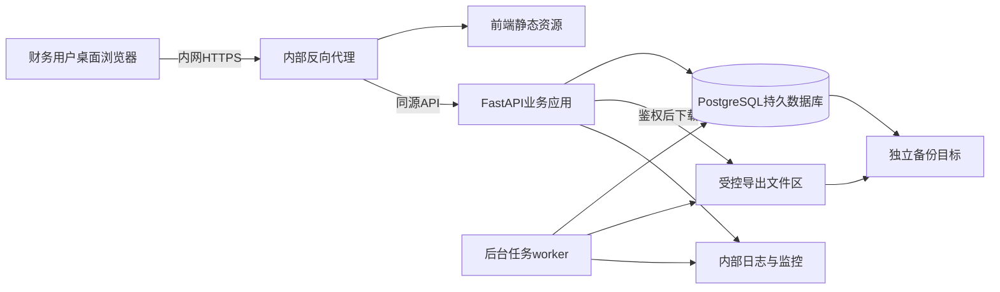
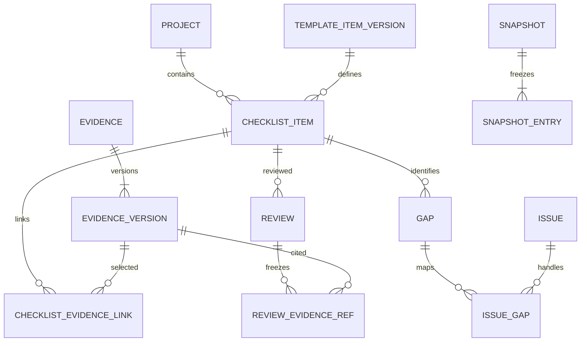
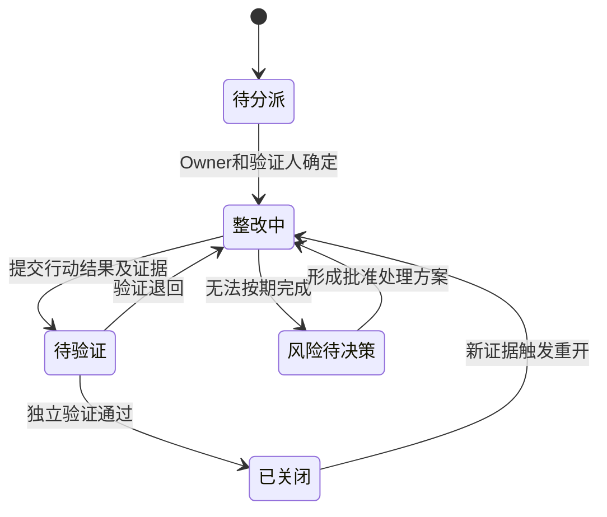

# 第一阶段技术开发文档

> 项目：A股主板IPO财务资料与整改工作台  
> 版本：V0.1 评审草案  
> 日期：2026-10-08  
> 阶段建议：目录模式下的P0业务闭环  
> 当前状态：技术设计，尚未开始应用开发

第一阶段拟交付一个运行于公司内网的财务资料工作台。财务人员可以按主体和期间生成清单，登记获准目录，由另一人复核，并将缺口转为可验证的整改事项；CFO通过看板和冻结快照掌握进度。本阶段使用人工流程，不接收原件，不运行OCR或模型任务。

本文件把[产品需求文档](<A股主板IPO财务资料与整改工作台 产品需求文档.md>)的要求展开为可实现、可测试的设计，部署差异按[技术适配声明](<技术适配声明.md>)处理。未获确认的范围、版本和容量参数均为评审建议，不作为已完成开发、已获公司准入或已承诺工期的证明。

## 一 阶段目标与范围

### 1 阶段完成的业务结果

用虚构演示数据先跑通以下流程，再在公司批准目录字段和人员分工后开展真实试点：

1. CFO确定项目范围，PMO维护主体、期间和模板草稿，由另一人批准发布。
2. PMO预检并生成候选清单；确认适用性，分派经办、复核人和截止日。
3. 经办登记A模式目录，关联固定元数据版本，提交复核。
4. 独立复核人接受、退回或记录受限离线核查；差异可形成缺口。
5. 整改Owner提交行动结果和目录证据，由独立验证人关闭；延期保留原截止日。
6. CFO查看可下钻统计，PMO或CFO按权限冻结快照并申请目录导出。
7. IT能够在不读取业务内容的日常运维界面中检查健康状态，并执行受控备份与恢复。

### 2 与PRD的交付映射

| PRD需求 | 本阶段交付 | 明确后置的部分 |
| --- | --- | --- |
| F01 项目与范围 | 项目、主体、期间、范围版本和规则待决事项 | 正式范围由CFO提供，不预设报告年数 |
| F02 清单 | 幂等生成、适用性、批量分派、列表与详情、权限过滤 | 智能适用性推断 |
| F03 资料与版本 | A模式目录、不可覆盖元数据版本、多项引用、受限信息控制 | B/C原件上传、文件去重、扫描质量、预览及存储 |
| F04 独立复核 | 固定版本复核、退回、重核、离线核查记录 | 原件在线核验 |
| F05 整改 | 缺口、分派、行动、延期、验证、重开与完整历史 | 外部部门账号协作 |
| F06 看板 | 六类指标、按领域风险分布、我的待办、周度快照趋势 | 自动推送提醒；无快照时不生成虚构趋势 |
| F07 快照与导出 | 不可变快照、目录CSV、manifest、审批与鉴权下载、人工基线录入 | 原件包、自动采集全部人工工时 |
| F08 AI候选 | 服务端禁用边界和清晰状态说明 | OCR、模型、向量库、候选确认页业务功能 |
| F09 模板治理 | 33项草稿种子、独立发布、差异待审、来源和版本 | 在线规则自动抓取 |
| F10 旧表与提醒 | 页面内按当前状态查询我的待办 | 旧Excel迁移、批次撤销、7/3/1天自动提醒 |

本阶段是V1.0的一个受限交付切片。不能把B/C上传、文件哈希测试和AI质量评测记为本阶段通过，也不把其后置解释为永久删除PRD要求。阶段定义不是原12周计划中的前两周，实际工期需在人员和环境确定后估算。

### 3 用户与角色

业务角色为CFO、财务PMO、财务经办、独立复核。IT运维拥有独立的运维权限，不默认获得业务目录、报表或快照内容权。生产、质量、销售、法务和中介机构仅作为资料来源，不建立本期登录角色。

账号绑定稳定的人员标识`person_id`。同一人即使有多个角色或账号，仍按人员标识检查自审；账号停用不删除历史操作人。正常配置限制每名人员一个活动业务账号。

## 二 架构与技术基线

### 1 整体结构

采用模块化单体：一个后端代码库处理权限、业务与事务；一个同代码库worker处理可重试的批次和导出。前端构建为静态资源，经内部反向代理访问同源API。数据库和worker不向用户终端开放端口。



浏览器静态资源、业务API、导出下载统一来源，默认关闭跨域。数据库备份和导出存储不得映射为公开静态目录。运行环境默认禁止公网访问；构建依赖由公司批准的仓库或离线包提供。

### 2 建议选型

| 组件 | 建议 | 实现约束 |
| --- | --- | --- |
| 前端 | React、TypeScript、Vite、Ant Design | 桌面业务表格优先，所有状态有文字；不加载公网CDN、字体或统计脚本 |
| API | Python、FastAPI、Pydantic | 模块化路由，输入白名单，统一错误；具体Python版本按内网镜像确定 |
| ORM与迁移 | SQLAlchemy、Alembic | 状态变更显式事务，迁移单独运行，不在每个应用进程启动时自动迁移 |
| 数据库 | PostgreSQL | 集成测试、试点与生产使用同一数据库主版本，避免SQLite替代测试 |
| 认证 | 本地独立账号、服务端会话 | 预留SSO身份适配接口，本阶段不实现多种认证后端 |
| 后台任务 | 数据库任务表、独立worker进程 | 持久化、租约、重试、幂等；不依赖Web进程内的临时任务保证交付 |
| 交付 | Linux、Docker Compose、Nginx | 作为单机试点建议；公司不允许容器时需另行补充服务交付设计 |
| 测试 | pytest、真实PostgreSQL、Playwright | 覆盖服务端门禁、并发与浏览器主流程 |

本期不引入模型SDK、向量数据库、全文搜索服务、Kubernetes或分布式消息平台。依赖精确版本在启动开发时固定到锁文件和镜像摘要，形成软件组成清单；文档不以浮动的“最新版”作为交付条件。

Vite能够输出静态部署产物；FastAPI可以使用自建容器镜像。本项目据此选择静态前端和内部API服务的交付组合。[Vite构建说明](https://vite.dev/guide/build)、[FastAPI容器说明](https://fastapi.tiangolo.com/deployment/docker/)

### 3 环境划分

| 环境 | 数据 | 使用限制 |
| --- | --- | --- |
| 本地开发 | 虚构主体、代号、期间及人员 | 不导入真实财务资料或生产备份 |
| 集成测试 | 自动生成的边界与异常样本 | 可重复初始化；验证真实数据库行为 |
| 内网验收 | 公司批准的目录样本 | 有权限、审计、备份；仅获准人员访问 |
| 内网生产 | 获准目录及业务记录 | 通过业务、IT和资料准入门禁后开放 |

环境使用不同账号、密钥和数据库。演示账号不得随生产包启用；前端构建变量只含公开配置，秘密不进入浏览器。数据库连接配置从受控位置注入。

## 三 模块与页面设计

### 1 后端模块边界

| 模块 | 职责 | 主要依赖 |
| --- | --- | --- |
| identity | 账号、人员、会话、角色和授权范围 | 审计 |
| projects | 主体、期间、范围版本和待决事项 | identity |
| templates | 稳定主题编号、草稿、发布与差异 | projects、identity |
| checklists | 清单实例、分派、适用性和进度 | templates、projects |
| evidence | A模式目录、字段准入、版本及引用 | projects、授权策略 |
| reviews | 固定版本复核、退回和离线核查 | checklists、evidence |
| issues | 缺口、整改、行动、延期与验证 | reviews、evidence |
| reporting | 同口径聚合、快照、导出和工时基线 | 所有业务模块 |
| audit | 追加事件、审计查询和完整性校验 | 关键命令与受控读取 |
| jobs | 清单生成批次、导出任务及重试 | reporting、checklists |

路由负责协议和输入，服务层负责授权与状态守卫，数据层负责查询和约束。禁止前端直接决定“已接受”“已关闭”；禁止通过通用更新接口写入审核结果字段。

### 2 页面与导航

| 页面 | 建议前端路由 | 本阶段关键内容 |
| --- | --- | --- |
| 登录 | `/login` | 独立账号、通用失败提示、过期后重新登录 |
| P01 首页 | `/projects/:projectId/dashboard` | 指标、风险、我的待办、快照差异；始终显示筛选及截至时间 |
| P02 清单 | `/projects/:projectId/checklists` | 适用性、进度、Owner、复核人、期间、截止日；20/50/100分页 |
| P03 清单详情 | `/checklists/:id` | 验收条件、当前资料版本、复核历史、缺口与整改 |
| P04 目录登记 | `/projects/:projectId/evidence/new` | 仅A模式；代号、范围、保管位置、准入依据及关联项 |
| P05 版本详情 | `/evidence/:id` | 当前及历史元数据版本、替换原因、引用影响 |
| P06 整改列表 | `/projects/:projectId/issues` | 原截止日、批准截止日、延期次数、Owner、验证人和风险 |
| P07 整改详情 | `/issues/:id` | 事实、行动、证据、延期、验证与重开时间线 |
| P09 设置 | `/projects/:projectId/settings` | 范围、人员分派、模板、目录字段准入和待决事项 |
| P10 报表 | `/projects/:projectId/reports` | 快照、导出申请、基线样本与效率数据 |
| P08 AI候选 | 不开放业务路由 | 设置中说明本期未启用；不存在可执行AI操作 |

需登录的页面只改善体验，服务端仍逐请求鉴权。列表、下钻和导出共享规范化筛选对象。无权限、无数据、分母为零、加载失败分别显示；错误给出可执行的下一步和`trace_id`，不显示堆栈。

## 四 数据模型与约束

### 1 标识与通用字段

内部对象使用UUID，对用户展示可读业务编号。时间戳在数据库中使用带时区类型并统一存储，界面按Asia/Shanghai显示；截止日使用业务日期，超过该日当地23:59:59且未关闭计为逾期。这个截止口径为待确认的技术细化。

可变聚合根含`row_version`用于并发控制。已发布模板、元数据版本、复核结果和快照内容不可更新；更正通过新版本或追加决定表达。`created_by`、`submitted_by`与执行时的`person_id`均保留，不受后续账号改名影响。

### 2 核心数据表

| 实体 | 关键字段 | 约束或用途 |
| --- | --- | --- |
| person、user_account、session | 人员ID、账号状态、密码哈希、会话哈希、到期和撤销时间 | 不保存明文密码或明文会话令牌；人员去重 |
| membership、object_grant、authorization_revision | 项目、主体、角色、对象、允许动作、有效期、权限修订号 | 授权范围求交后再执行对象约束；修订号用于并发检查和缓存失效 |
| project、organization、period | 项目、稳定主体ID、统一代码、别名、起止日期 | 同一主体统一代码唯一；期间无预设年数 |
| project_scope_version | 版本号、主体/期间集合、业务标签、决定人 | 范围变更新增版本，旧实例不删除 |
| template、template_version、template_item_version | 稳定主题ID、版本、来源、条件、验收点、编制人 | 33项主题编号跨模板版本稳定；发布后不可覆盖 |
| template_change | 新旧版本、差异、目标清单、处理结论 | 差异逐项评估，不覆盖旧结论 |
| checklist_item | 项目、稳定主题ID、主体、期间、口径键、适用性、进度、Owner、复核人 | 唯一键不包含模板版本或范围版本，避免升级生成重复业务需求 |
| personal_view | 人员ID、项目、页面、视图名、筛选与排序 | 只能修改本人视图，不改变团队默认视图；读取仍重新鉴权 |
| applicability_decision | 清单ID、提议值、理由、提议人、批准人、状态 | 不适用须独立批准；未知不按false处理 |
| admission_policy | 依据编号、批准人员/机构、获准字段、项目主体、用途、有效期、状态 | 记录已有公司审批的结果，不在系统内作涉密认定 |
| evidence | 项目、逻辑资料ID、代号、模式、当前版本ID | 本阶段模式只能为A；不能含文件对象地址 |
| evidence_version | 资料ID、版本、准入依据、元数据、提交人、替换原因、metadata_hash | 元数据版本不可变；A模式没有原件哈希 |
| checklist_evidence_link | 清单ID、资料ID、当前引用版本、覆盖范围、关联状态 | 支持一份资料多项引用；关联变更写历史 |
| checklist_submission、submission_evidence_ref | 清单ID、提交人、提交时验收标准版本、资料版本集合、提交时间 | 每次提交生成不可覆盖记录；复核以该提交为依据 |
| review、review_evidence_ref | 清单、提交ID、决定、原因、验收点、复核人、固定版本ID集合 | 提交人与复核人不同；结论不随当前引用指针移动 |
| offline_verification | 获准代号、核查人、方式、日期、范围、准入依据、结论 | 受限核查不保存原件或未经批准的核查内容 |
| gap、issue_gap | 缺口事实、来源清单/复核/版本、整改关联 | 缺口与整改为多对多，归并不丢来源 |
| issue、issue_action、issue_evidence_ref | 严重性、Owner、验证人、状态、原/现截止日、行动、证据版本 | 关闭前须满足证据和独立验证；原截止日不可覆盖 |
| extension_request、issue_verification | 申请、原因、新日期、决定人、结果、时间 | 申请人与批准人、Owner与验证人分别不同 |
| snapshot、snapshot_entry | 固定筛选、范围/模板/口径版本、截至时间、冻结行、manifest_hash | 内容不可变；保留版本引用和当时展示值 |
| export_request、export_artifact | 用途、申请/审批人、快照、字段范围、权限版本、路径、到期、文件哈希 | 审批绑定内容范围；下载重新检查当前权限 |
| metric_sample | 任务类型、计时、样本分层、来源事件、录入人、说明 | 人工工时与系统耗时区分；修正留版本 |
| job、idempotency_record | 类型、请求摘要、状态、租约、重试、结果引用 | 请求重放返回原结果；同键不同载荷拒绝 |
| audit_event | 操作者、对象、动作、结果、时间、trace_id、前后摘要、依据编号 | 应用只追加；敏感正文不进入普通日志 |

JSON字段仅用于有版本的元数据、验收点和冻结内容；项目、人员、版本关系及唯一键使用关系字段和外键，不依赖任意JSON保证关键完整性。

### 3 关系示意



图中仅显示主要业务关系；人员、主体、期间、授权、审计和任务表以数据字典为准。

### 4 目录字段白名单

A模式建议字段为：批准代号、资料类型、所属主体、覆盖期间、保管部门、获准位置代号、取得状态、元数据版本描述、准入依据，以及明确获准的日期/凭证索引。具体启用字段由`admission_policy`约束，不默认允许客户名称、合同标题、金额、图纸、合同正文或任意附件链接。

取得状态使用“未收集、已定位、待取得、受限待核、无法取得、经核实不存在”等可区分值；“无法取得”和“经核实不存在”需要原因和人工记录。不能统一变成缺件，更不能自动变成不适用。

自由文本有长度限制和用途提示；原文粘贴、Base64附件和任意外部URL均不属于允许字段。系统不声称自动识别全部敏感信息，真实目录准入仍依赖公司批准及人员操作要求。

### 5 模板种子导入设计

33项草稿种子来自PRD第4.2节：FIN 5项、REV 7项、AR 3项、INV 6项、CASH 4项、TAX 3项、RP 2项、IC 3项。开发时保留原主题编号、标题、最小验收标准与来源说明；原“初始负责人”是岗位建议，不能直接写成实名分派。

初始种子处于草稿或待评审状态，不以安装系统等同财务批准发布。可在演示项目使用明确标注的演示发布版本。公司自定义项获得稳定主题编号，必须包含可执行的验收条件，不能伪装成法规要求。

## 五 状态与事务设计

### 1 适用性与资料进度分离

适用性字段为`pending / applicable / not_applicable`。财务专业人员确认适用并留理由；改为不适用由另一人批准。存在未处理整改时阻止直接排除，需逐项记录处理决定。规则条件为未知时，候选保持待确认。

资料进度包含未开始、待收集、已提交、复核中、已接受、退回补充、受限待核、受限已核、阻塞、待重新复核。`待重新复核`是对PRD版本变更规则的显式实现，不复用“已接受”加一个仅前端可见标记。

| 动作 | 前置检查 | 结果 |
| --- | --- | --- |
| 提交 | 已适用，Owner/复核人/截止日齐全，至少一份有效目录版本，提交者有权 | 冻结本次提交版本集合，转已提交 |
| 开始复核 | 指定或获授权复核人，非提交人员，提交版本仍有效 | 转复核中 |
| 接受 | 验收点全部处理，来源及准入有效，版本集合未改变，非自审 | 追加接受记录，转已接受 |
| 退回 | 同上权限，有原因码与具体补充动作 | 追加记录，转退回补充 |
| 离线受限核查 | 有获准核查记录、核查人与经办分离、范围匹配 | 转受限已核，单列展示，不计入普通已接受分子 |
| 新版本或引用变化 | 涉及当前有效依据的新增版本、元数据修改或关联变动 | 旧记录保留；当前接受结论失效，转待重新复核 |
| 准入撤销或过期 | 读取与操作时实时核验有效性 | 立即停止授权展示和有效统计，记录待重评原因 |
| 调整项目范围 | 新范围版本获准 | 旧项标记非当前范围，保留历史；新增项按唯一键生成 |

受限已核单列遵循PRD对受限资料不冒充已上传的要求。若财务希望将其计入另一项管理完成率，须另定义指标名称和分母，不能改写“已接受率”。

### 2 整改状态



延期是独立审批记录，不等于状态自动关闭。批准后才更新当前截止日，并增加批准延期次数；驳回和未批申请不改变逾期依据。风险待决策仍属于未关闭事项。严重性调整、重开和归并均保留理由。

关闭事务检查：Owner与验证人不同、所有关键行动及阻塞已处理、关联证据有效、验证意见完整。资料变更先通知或标记验证人待评估，只有记录重开决定后改变已关闭状态，不自动抹去曾经关闭的事实。

### 3 并发与幂等

状态命令携带`expected_version`。服务端锁定或条件更新聚合根，并同时检查版本、人员、授权和状态。并发提交只有一个成功，另一请求返回409及最新版本号，不自动合并审核结论。

涉及多个对象时采用统一锁顺序：权限及准入控制行、按ID排序的资料聚合根、按ID排序的清单项、整改项。接受、换版和新增资料关联都遵守该顺序，防止“复核检查后资料已经换版”的竞态。发生死锁或序列化冲突时回滚整个命令，再按幂等记录安全重试，不跳过版本检查。

清单生成唯一键为`项目 + 稳定主题ID + 主体 + 期间 + 口径键`。模板升级产生差异记录，不能通过新模板版本ID绕过唯一性。重复生成不重置已分派人员、复核和整改。

创建、生成、提交、批准和导出请求使用`Idempotency-Key`，按当前人员与操作作用域存储请求哈希和结果。同键同载荷返回原结果；同键不同载荷返回409。重放也需验证当前权限，撤权后不能靠旧请求键取得对象内容。

批量分派和清单生成按行事务处理，返回逐行成功/失败；合法行不因其他行失败回滚。单项接受、延期批准和整改关闭则必须原子完成，禁止部分成功。

### 4 审计与副作用

关键命令把业务变更、成功审计事件及需要执行的后台任务同事务写入。worker只处理已提交任务，使用租约避免重复并发执行；重试不能重复创建清单、快照或导出记录。

拒绝访问和失败动作使用独立的受控日志路径记录，避免随业务回滚丢失。审计系统完全不可写时返回503，关键写入和导出失败关闭，同时由运维渠道告警。不要通过关闭审计配置恢复业务写入。

读取目录、搜索、快照、下载同样记录必要审计。审计内容保存编号、动作与摘要，避免复制客户名称、金额或自由文本；普通运行日志只记录trace_id、状态码、耗时和错误码。

## 六 认证与权限

### 1 账号与会话

账号由获授权的身份管理员根据人员清单开通，财务业务授权另由CFO或获授权PMO维护；身份管理能力不自动授予业务读取权。首次凭据通过公司受控渠道交付，首次登录须重设密码。关闭公开注册、共用邀请码和默认生产账号。

密码使用Argon2id等经公司认可的密码哈希实现及独立盐，不用普通SHA-256存储密码；参数在目标环境验证后固定。会话使用高熵随机令牌，数据库仅保存其哈希，Cookie设置`Secure`、`HttpOnly`、明确的`SameSite`与受限作用域。状态变更请求执行CSRF令牌和来源校验，不把`SameSite`当成唯一防护。[OWASP密码存储指南](https://cheatsheetseries.owasp.org/cheatsheets/Password_Storage_Cheat_Sheet.html)、[OWASP会话指南](https://cheatsheetseries.owasp.org/cheatsheets/Session_Management_Cheat_Sheet.html)

建议的试点会话参数为闲置30分钟、绝对时长8小时，登录失败限速和锁定策略按公司规定冻结。登出、密码重置、人员停用和强制撤销使旧会话失效；权限撤销在下一个请求生效。恢复数据库后使既有会话失效，避免恢复旧会话权限。

### 2 统一授权判定

每次请求依次检查：身份有效 → 项目成员关系 → 主体范围 → 角色允许动作 → 对象分派或显式授权 → 目录字段与准入有效性 → 人员分离 → 状态及版本守卫。任一步不满足即拒绝。

列表在数据库查询阶段加权限条件，再统计、排序、分页。详情、搜索建议、批量动作、快照和下载使用同一策略；不能先查出所有记录再由前端隐藏。服务端默认拒绝并逐请求校验符合OWASP授权建议，财务对象条件由本项目另外实现。[OWASP授权指南](https://cheatsheetseries.owasp.org/cheatsheets/Authorization_Cheat_Sheet.html)

准入有效期和当前版本有效性参与实时查询条件，不等待后台任务改完全部状态才扣回统计。后台任务只补齐待重评记录和提示。涉及业务数据的响应默认禁止共享缓存；前端在登出、项目切换和鉴权失败时清理已有数据缓存。

| 操作 | 业务资格 | 强制对象条件 |
| --- | --- | --- |
| 模板发布 | CFO或指定独立审核人 | 与编制人为不同人员，验收条件完整 |
| 清单分派 | PMO或CFO | Owner和复核人不同，均在项目及主体授权范围 |
| 目录提交 | 获授权经办 | 字段和用途获准，关联目标有权访问 |
| 接受或受限核查 | 获授权复核人 | 不属于本次提交人及引用资料版本提交人员集合 |
| 不适用批准 | 获授权独立复核人 | 与提议人不同，理由完整，未决整改已有处理 |
| 整改验证 | 指定独立验证人 | 与Owner及本次整改提交人不同，证据有效 |
| 延期批准 | CFO或授权审批人 | 与申请人不同，原截止日不可改写 |
| 快照及导出申请 | CFO或获授权PMO | 范围、字段及用途有权；导出批准人另行指定 |
| 导出批准 | CFO或授权审批人 | 建议与申请人不同，绑定固定快照与字段范围 |
| 系统运维 | IT运维 | 默认不能进入业务数据接口或下载目录 |

导出申请人与批准人分离是本技术草案新增的控制建议，需在评审时确认；在确认前不把某人拥有CFO角色视为可自批的授权。

### 3 准入与功能关闭

`admission_policy`只登记线下或公司现有流程的批准事实。登记人、核验人、依据编号和有效范围均记录；可由财务中已获公司授权的人核验，不要求保密部门成为系统用户。未提供可核验依据时只允许虚构演示数据。

第一阶段上传和AI接口始终拒绝，网关另设请求体大小限制，应用在解析和持久化文件前执行拦截。不存在后台OCR或模型任务队列。B/C模式不能由用户提交字段、管理员页面或单个环境变量直接开启，须交付后续实现并独立验收。

## 七 接口契约

### 1 公共约定

API前缀为`/api/v1`，采用JSON协议和Cookie会话。读取成功返回`data`、必要的分页信息、`as_of`与`trace_id`；分页总数必须是当前权限及筛选下的总数。错误统一返回`error.code`、可读`message`、必要字段错误与`trace_id`。

输入模型拒绝未声明字段；排序列、筛选枚举、页大小采用白名单。客户端不能提交`reviewer_id`来冒充执行人，服务端从会话取当前人员。服务器决定动作时间、审批结果写入人和对象业务编号。

| 状态码 | 场景 |
| --- | --- |
| 401 | 未登录、会话过期或被撤销 |
| 403 | 越权、自审、资料准入不允许或功能禁用 |
| 404 | 对象不存在；无权对象可统一采用不泄露内容的错误策略 |
| 409 | 乐观锁冲突、幂等键载荷冲突、当前状态不允许动作 |
| 422 | 必填、日期、枚举、字段白名单等输入校验失败 |
| 429 | 登录或请求限速 |
| 503 | 审计、数据库等必要依赖不可用，动作未提交 |

PRD中的原件猜链访问用例要求403；本期预留原件端点即使没有实现存储也返回明确的禁用拒绝。任何错误都不返回对象标题、内部文件路径或堆栈。

### 2 主要接口清单

下表为开发契约草案，ID均由服务端解析并核验范围；不是已经存在的接口。

| 方法与路径 | 动作及关键输入 | 结果与约束 |
| --- | --- | --- |
| `POST /auth/login`、`POST /auth/logout`、`GET /me` | 登录、退出和当前权限概况 | 登录轮换会话；退出撤销服务端记录 |
| `POST /users`、`POST /users/{id}/disable`、`POST /users/{id}/reset-credential` | 授权身份管理员管理账号 | 不默认增加业务授权；停用及重置撤销会话 |
| `POST /projects/{id}/memberships`、`POST /memberships/{id}/revoke` | CFO或授权PMO配置人员范围 | 更新权限修订号；不能越过自身可授予范围 |
| `POST /projects`、`POST /projects/{id}/scope-versions` | 项目与主体期间范围 | 新范围版本及影响预览；不删除旧实例 |
| `POST /templates/{id}/versions` | 模板草稿及验收条件 | 新草稿版本，记录编制人 |
| `POST /template-versions/{id}/publish` | 审核意见与expected_version | 独立发布，生成差异待审 |
| `POST /projects/{id}/checklist-previews` | 范围、模板版本和口径 | 新增、已存在、未知和冲突预估 |
| `POST /projects/{id}/checklist-jobs` | 预检引用、固定参数、幂等键 | 202及任务ID；参数变化须重新预检 |
| `GET /jobs/{id}` | 查询批次进度 | 当前有权的行级结果，不泄露撤权对象 |
| `GET /projects/{id}/checklists` | 筛选、排序、页码 | 有权清单、总数、口径与as_of |
| `POST /me/views`、`PATCH /me/views/{id}` | 保存个人筛选和排序 | 仅本人视图；不保存数据副本或绕过权限 |
| `POST /checklists/assignments` | 对象ID、各自版本、Owner、复核人、截止日 | 批量逐行结果 |
| `POST /checklists/{id}/applicability-proposals` | 候选值、具体理由 | 不适用形成待独立批准记录 |
| `POST /applicability-proposals/{id}/decisions` | 批准或退回、理由 | 人员分离和未决整改检查 |
| `POST /projects/{id}/admission-policies` | 公司批准依据和范围 | 待核验记录，不在此产生保密认定 |
| `POST /admission-policies/{id}/verify`、`POST /admission-policies/{id}/revoke` | 授权核验或撤销 | 记录依据和人员，撤销立即影响读取及有效统计 |
| `POST /projects/{id}/evidence` | A模式白名单元数据 | 资料ID及第一个元数据版本 |
| `POST /evidence/{id}/versions` | 新元数据、替换原因、expected_version | 新版本，相关当前结论待重核 |
| `POST /checklists/{id}/evidence-links` | 资料版本ID、覆盖范围 | 建立引用及复核影响记录 |
| `POST /checklists/{id}/submissions` | 当前引用集合、expected_version | 冻结本次提交依据 |
| `POST /checklists/{id}/reviews` | 决定、验收点、原因、固定版本集合 | 接受或退回记录与状态同事务 |
| `POST /checklists/{id}/offline-verifications` | 核查代号、方式、范围、结论 | 受限已核记录及独立统计 |
| `POST /projects/{id}/gaps`、`POST /projects/{id}/issues` | 来源、事实、责任、日期和严重性 | 缺口与整改，可多对多关联 |
| `POST /issues/{id}/actions`、`POST /issues/{id}/submit-verification` | 行动、目录证据和expected_version | 执行记录或转待验证 |
| `POST /issues/{id}/verifications`、`POST /issues/{id}/reopen` | 验证决定或重开理由 | 独立关闭、退回或重开 |
| `POST /issues/{id}/extension-requests`、`POST /extension-requests/{id}/decisions` | 新截止日、原因、决定 | 批准后更新当前日期并保留历史 |
| `GET /projects/{id}/dashboard` | 与清单一致的筛选 | 指标、分子分母、风险项及as_of |
| `POST /projects/{id}/snapshots` | 范围、用途、口径 | 冻结时点的新快照 |
| `POST /snapshots/{id}/export-requests`、`POST /export-requests/{id}/decisions` | 字段、用途、批准决定 | 绑定固定范围，批准后创建任务 |
| `GET /exports/{id}/download` | 当前会话 | 实时权限与审批检查后流式下载 |
| `POST /projects/{id}/metric-samples` | 人工基线或实际工时、分层、来源 | 留痕样本，供效率报表使用 |
| `POST /evidence/uploads`、`POST /ai/tasks` | 任意尝试 | 403，禁用原因明确，不存文件、不入队 |
| `GET /health/live`、`GET /health/ready` | 受限运维检查 | 仅最小健康信息；就绪检查必要依赖 |

### 3 命令示例

以下仅说明协议，不是开发实现或可执行部署脚本。

```json
{
  "expected_version": 7,
  "decision": "accept",
  "evidence_version_ids": ["示例资料版本ID"],
  "checks": [
    {"code": "entity_match", "result": "confirmed"},
    {"code": "period_covered", "result": "confirmed"}
  ],
  "reason": "已按获准目录与验收条件完成复核"
}
```

`checks`须覆盖该模板版本要求的全部检查点；示例的两个检查点不构成完整验收条件。若提交人与复核人为同一人员，返回`SELF_REVIEW_FORBIDDEN`；若证据版本变化，返回`EVIDENCE_VERSION_CHANGED`并要求重新打开当前资料。

## 八 看板 快照与导出

### 1 指标口径

| 指标 | 计算方式 | 特殊处理 |
| --- | --- | --- |
| 适用项 | 当前范围内、人工确认适用、有权的清单实例数 | 待确认和不适用单列 |
| 已接受项及比例 | 当前引用版本仍有效且独立接受的实例数 / 适用项数 | 任一相关依据失效则扣回；分母零显示暂无可计算分母 |
| 待确认 | 当前适用性为pending的实例数 | 不是零风险或不适用 |
| 受限 | 受限待核及受限已核分别计数 | 不混入普通已接受项 |
| 未关闭整改 | 待分派、整改中、待验证、风险待决策 | 关闭后重开重新计入 |
| 逾期整改 | 当前日期超过已批准截止日且未关闭 | 原截止日、批准延期次数持续显示 |
| 责任覆盖率 | Owner、复核人、截止日齐全且合法的适用项 / 适用项 | 人员停用或权限失效时另列分派异常 |
| 净节省工时 | 同类基线平均工时×完成量－实际工时－新增维护、复核和运营工时 | 可为负；样本不足只显示原始值与样本量 |

点击卡片复用该卡片的规范化筛选；若期间发生业务变动，界面提示数据已刷新并给出新as_of，不能保证跨多个实时请求永久保持旧计数。需要严格复现时进入固定快照。无权范围不在聚合里出现，亦不显示暗示隐藏对象数量的差值。

任务提出、目录可供复核确认、首次提交、首次决定等事件保留时间，以支撑定位耗时和复核周期。人工实际工时单独记录；系统经过时间不直接等同人工劳动时间。

### 2 冻结快照

快照采用数据库一致性事务读取固定范围内的版本、状态和统计结果，保存冻结行及引用ID，不仅保存一个指向实时列表的筛选URL。拟采用PostgreSQL Repeatable Read获得同一事务内稳定读取视图；并发写冲突需整体重试，关键业务唯一性仍由约束和锁负责。[PostgreSQL事务隔离说明](https://www.postgresql.org/docs/current/transaction-iso.html)

实现流程为：核验权限及范围 → 建立一致性事务 → 写入冻结内容和审计 → 生成确定性的manifest → 提交。采用项目级权限修订号，并对授权变更与快照提交实施一致的锁顺序；若准入到期或权限版本改变，拒绝发布该结果并重新计算。导出任务启动和下载时仍重新核验当前权限。

manifest包含`snapshot_id`、固定`as_of`、范围版本、模板版本、口径版本、排序后的对象与元数据版本ID、字段及冻结值。用明确的规范化JSON编码规则计算SHA-256：UTF-8、稳定键顺序、稳定数组排序、确定空值与日期格式；不加入本次下载时间或临时路径。

同一快照与同一导出规格重复生成的manifest哈希应一致。导出文件另记`artifact_hash`；CSV换行、编码、列顺序等也固定。快照内容不可改写，但用户查看权限按当前授权判断。

### 3 导出与撤权

本期导出目录CSV及manifest，不包含原件。字段以白名单确定，文本单元格对可能触发表格公式执行的前缀进行安全处理；引用数据不得拼接为可访问的任意网络链接。

批准记录绑定快照ID、字段集合、用途、范围摘要和有效期，任何一项变化必须重新审批。建议导出下载有效期24小时，实际值由公司留存要求确定。导出产物在独立受控文件区保存，通过应用鉴权后下载，不生成绕开应用权限的长期直链。

撤销人员权限或资料准入后，下一个下载请求立即拒绝；已下载到终端的副本无法由系统追回，需按公司外发和终端管理制度处理。对于仍在传输中的大文件，后续原件阶段需增加传输中止策略，本期不据此宣称可追回已传输字节。

若用户失去快照中部分对象的权限，拒绝下载原完整包。需要较小范围时创建新快照和新审批，不能静默删行后沿用原manifest哈希。导出产生的临时文件在失败后清理；清理失败记运维事件，绝不公开临时路径。

## 九 数据持久化与内网交付

### 1 持久化边界

PostgreSQL数据位于公司批准的持久卷，不能写入容器可写层或`/tmp`。导出文件、运行日志、审计数据和备份分别管理权限与留存。挂载持久卷不等于已有备份，同一磁盘上的另一目录也不构成独立故障域。

数据库应用账号不具备超级用户权限；模式迁移、备份和应用使用不同账号。对不可变表限制UPDATE/DELETE，并通过应用逻辑、数据库约束或触发器共同防护。数据库管理员的紧急操作有独立授权和记录，不能声称应用约束能够阻止所有管理员修改。

第一阶段不存原件，但目录可能仍有业务敏感性。磁盘和备份加密、密钥托管、运维访问与保留周期采用公司标准；未确定标准前不能以“只有目录”为由跳过准入评审。

### 2 备份与恢复设计

试点目标暂按PRD建议的RPO不超过24小时、RTO不超过8小时设计。RPO表示故障时最多可接受的恢复点差距；RTO表示恢复服务的目标用时，均需IT确认。

建议每12小时执行一次数据库逻辑备份，为24小时目标留出失败重试余量，备份完成后校验并复制到独立目标。备份失败立即告警；监控“最近成功且可恢复备份”的年龄，不能仅监控计划任务执行。保留周期由公司确定，未冻结前不自动清除业务历史。

`pg_dump`提供一致性的单数据库备份；数据库角色等集群级恢复材料需要另行处理。恢复包还包括模式迁移版本、镜像摘要、配置清单、受控恢复密钥材料及必要导出产物。[PostgreSQL逻辑备份说明](https://www.postgresql.org/docs/current/backup-dump.html)

快照冻结内容和manifest以数据库为准，目录导出可根据已冻结内容重新生成。导出文件区应与备份清单核对；若原产物缺失则标记待重建，重新验证授权及审批后再开放下载，不能出现数据库记录成功但下载空文件。

恢复演练按以下顺序执行：隔离恢复环境 → 从选定备份恢复数据库和角色 → 挂载必要受控文件 → 校验模式及对象数量、版本引用和manifest → 撤销恢复出的旧会话 → 验证准入与账号撤销状态 → 执行目录复核、整改和快照抽样 → 记录实际恢复时间及恢复点。只有证明目标满足才记录通过。

### 3 运行配置契约

下列名称为拟设计配置，不表示当前项目已有对应代码。

| 配置项 | 用途 | 生产校验 |
| --- | --- | --- |
| `APP_ENV` | 区分开发、测试、验收、生产 | 生产关闭调试和演示数据初始化 |
| `DATABASE_URL` | PostgreSQL连接 | 必填，受控注入，不打印值 |
| `TRUSTED_HOSTS`、`APP_ORIGIN` | 内部访问域名与可信来源 | 必填，不使用任意来源通配 |
| `SESSION_IDLE_MINUTES`、`SESSION_MAX_HOURS` | 会话期限 | 正数且在获准策略内 |
| `EXPORT_STORAGE_ROOT` | 持久导出区 | 可写但不可由静态入口直接读取 |
| `EXPORT_TTL_HOURS` | 导出下载有效期 | 按批准的留存策略校验 |
| `DIRECTORY_ONLY` | 声明本期仅目录能力 | 本期生产必须为true；false启动失败 |
| `UPLOAD_ENABLED`、`AI_ENABLED` | 防止部署配置误开功能 | 本期生产必须为false；true启动失败 |
| `AUDIT_REQUIRED` | 声明必要审计 | 生产必须为true，不提供跳过开关 |
| `LOG_LEVEL` | 运维日志级别 | 生产不记录请求正文、凭据或敏感字段 |

这些标志与路由和服务层硬性限制共同生效。配置存在不证明实现安全，错误组合须在启动和就绪检查中失败。不可用配置采用明确错误码，错误信息仅报告缺失的键名。

### 4 后续发布顺序

1. 固定代码版本、依赖锁文件、许可证清单和镜像摘要，在受控构建环境生成离线产物。
2. 验证目标网络、证书、持久卷、备份目标和受控配置，不创建公网入口。
3. 执行部署前备份，检查迁移兼容性；迁移仅由专用任务执行一次。
4. 启动数据库、API和worker，验证就绪后加载前端产物。
5. 在受限访问条件下完成会话、权限、目录、复核、整改、快照及重启测试。
6. 完成备份恢复演练、业务签字和运维移交，才开放获准财务账号。

回滚优先保留向后兼容数据库模式并切回上一应用版本。涉及破坏性迁移时，必须预先设计恢复或前向修复方案；不能盲目回退数据库而丢弃发布后的业务记录。具体切换步骤在实际交付时根据版本差异编制。

### 5 监控与容量

监控API可用性、P95延迟、5xx比例、数据库连接、磁盘容量、worker任务积压、审计写入失败、备份年龄和恢复校验结果。告警通过公司批准的内部渠道发送，内容只含服务、对象编号、时间和trace_id等必要信息。

试点验证集使用10个账号、5人并发、2,000项清单和10,000条目录元数据；清单筛选、详情和整改列表P95不超过3秒，目标来自PRD第11章。记录测试机器资源、索引、数据库体积和请求组合，以便判断结果适用范围。快照和导出采用异步任务，页面显示进度，不承诺未测的完成时长。

核心工作时间月度可用性99.5%为试点目标。单机部署存在主机故障窗口，必须通过监控和恢复能力评估是否适合公司要求，不能仅凭架构图保证SLA。CPU、内存、磁盘和备份容量在样本盘点与实测后冻结，本文件不作为采购规格。

## 十 开发分解与交付顺序

### 1 拟建工程目录

下列为后续工程结构建议，本次不创建这些代码目录。

```text
frontend/
  src/pages/             页面与路由
  src/features/          按清单 目录 复核 整改分组的交互
  src/shared/            通用组件 接口客户端 状态展示
backend/
  app/api/               路由与协议
  app/modules/           各业务模块的服务 模型与查询
  app/security/          身份 授权与准入策略
  app/workers/           持久任务执行
  migrations/            数据库迁移
  tests/                 单元 集成与权限测试
tests/e2e/               浏览器流程
seed/                    版本化模板草稿与虚构样本
deploy/                  内网交付定义及配置模板
docs/                    接口 数据字典 运维及验收记录
```

### 2 工作包与完成标志

| 工作包 | 主要实现 | 完成标志 | 依赖 |
| --- | --- | --- | --- |
| M0 基线冻结 | 阶段范围、人员分工、技术版本、目录白名单、协议和测试样本 | 决策有记录，演示与真实数据边界明确 | 产品、财务与IT输入 |
| M1 工程与权限底座 | 工程、数据库迁移、账号会话、授权、审计、配置校验 | 真实数据库集成测试通过，停用账号与跨范围访问被拒 | M0 |
| M2 项目与清单 | 主体期间、模板发布、33项种子、预检生成、适用性和分派 | 重复生成新增0条，独立发布与不适用审批生效 | M1 |
| M3 目录与复核 | 字段准入、版本、引用、固定版本提交、复核、受限核查 | 新版使旧接受失效，自审与未获准字段被拒 | M2 |
| M4 整改与管理 | 缺口关联、行动、延期、验证、重开、看板、快照导出、基线录入 | 三类缺口闭环，延期不掩盖历史，快照可复现 | M3 |
| M5 内网试点交付 | 离线包、配置、监控、恢复、性能与业务验收 | 本阶段阻断项清零，IT与财务验收记录齐全 | M4及试点环境 |

开发过程中每个工作包先交付可验证的业务能力，再进入依赖它的功能。可以在底座完成后并行进行部分页面设计，但不能通过前端模拟数据将服务端门禁标为完成。当前没有团队规模和可用工时信息，工作包不附承诺日期。

### 3 后续交付物清单

源码和依赖锁文件；版本化数据库迁移及初始模板；OpenAPI接口定义；对象权限表与测试报告；虚构验收样本；前端构建和后端镜像；配置模板与秘密清单；内网安装、升级、回滚和恢复手册；业务验收记录及后置需求清单。

交付报告分别注明“已实现”“已测试”“已部署”“已验收”。不能用其中一个状态代替其他状态，不能把本文中的设计示例当成实现产物。

## 十一 测试与阶段验收

### 1 对原PRD用例的处理

| 原用例 | 本阶段验证内容 | 验收归属 |
| --- | --- | --- |
| TC01 | 交易所未知只生成通用候选并列待决 | 必须通过 |
| TC02 | 相同范围重复生成无新增且历史不变 | 必须通过 |
| TC03 | 未知业务标签保留待确认，不自动不适用 | 必须通过 |
| TC04 | 无理由或自批不适用被拒 | 必须通过 |
| TC05 | 未获准原件提交被拒；获准目录可登记 | 必须通过 |
| TC06 | 原件重复哈希处理 | 后置；本期只测版本及请求幂等，不替代该用例 |
| TC07 | 扫描页序和质量检查 | 后置；本期无扫描件接收 |
| TC08 | 同一人员提交并自审被拒且留审计 | 必须通过 |
| TC09 | 目录元数据新版使当前接受失效，旧记录可追溯 | 目录路径必须通过；原件路径后置 |
| TC10 | 同一目录版本关联不同主题，分别独立验收 | 必须通过 |
| TC11 | 离线核查仅保存获准记录，不存原件 | 必须通过 |
| TC12 | Owner申请验证但不能自行关闭 | 必须通过 |
| TC13 | 两次批准延期后显示原/现日期和次数 | 必须通过 |
| TC14 | 修改业务资料不改变旧快照内容及manifest | 必须通过 |
| TC15 | 原件访问端点403，无原件；猜测有权范围外的目录亦被拒 | 拒绝路径必须通过；真实文件访问控制后置 |
| TC16 | 旧Excel完成状态的迁移映射 | 后置至F10导入交付 |
| TC17 | 无来源AI候选不能采纳 | 后置；本期无候选生成或采纳能力 |
| TC18 | 任意资料提交AI端点均被拒、不入队 | 禁用路径必须通过；C模式开放后的完整门禁后置 |

验收报告保留以上后置项及原因，不将其计为通过，也不宣称已完成PRD所有P0测试。

### 2 新增工程与业务边界用例

| 编号 | 场景 | 预期 |
| --- | --- | --- |
| ST01 | 两人同时接受与替换目录版本 | 只能依据有效版本完成一个合法结果；另一方409，不能留下有效旧结论 |
| ST02 | 同一人员换角色或第二账号尝试自审 | 按person_id拒绝 |
| ST03 | API绕过界面直接写已接受、已关闭字段 | 未声明字段或非法命令被拒 |
| ST04 | 准入过期或撤销后访问目录、看板、旧快照和下载 | 当前权限即时失效，有效统计扣回，无缓存泄露 |
| ST05 | 审计插入失败时批准、关闭或生成导出 | 业务状态不提交，返回503，运维告警 |
| ST06 | 同幂等键重复提交、同键换载荷 | 分别返回原结果、409，不生成重复对象 |
| ST07 | worker执行中重启 | 租约到期后可恢复，任务不重复产生业务结果 |
| ST08 | 所有项待确认或适用项分母为零 | 不显示100%完成；未知单列 |
| ST09 | 修改模板版本后重复生成清单 | 唯一业务项不重复，差异待审，原复核不重置 |
| ST10 | 未批准延期、风险待决策、关闭后重开 | 逾期和未关统计符合口径，历史完整 |
| ST11 | 同一快照重复导出；下载前撤权 | manifest一致；撤权后旧链接拒绝 |
| ST12 | 文本含公式前缀或HTML；CSV打开与页面展示 | 不执行公式或脚本，安全转义不丢业务含义 |
| ST13 | CSRF请求、过期会话、登出后旧Cookie | 拒绝请求，不能改变业务状态 |
| ST14 | 前后端离线运行，检查网络请求 | 无公网依赖、CDN、模型或外部遥测请求 |
| ST15 | 应用及数据库重启，再从独立备份恢复 | 持久记录可用；恢复点与时间满足获准目标 |
| ST16 | 批量分派部分行自审或越权 | 合法行成功，失败行有原因，不泄露无权内容 |
| ST17 | 工时收益为负或样本量不足 | 保留负数与样本信息，禁止自动美化 |
| ST18 | 请求启用UPLOAD_ENABLED或AI_ENABLED | 本阶段生产启动失败，不能只改配置开启 |

### 3 试点业务样本

至少覆盖FIN-01、FIN-02、REV-03、REV-04、REV-07、AR-01、INV-02、CASH-02、TAX-01、IC-01十类代表实例，覆盖两个主体或同一主体的两个期间。样本包含用友导出目录、纸档位置代号、受限记录、不适用、跨期疑点、退回、新版、延期和关闭。

至少三类缺口完成独立整改验证，例如缺目录要素、主体/期间不符、审批依据缺失。样本和结论须来自虚构演示或明确获准的目录内容；不用真实未批准原件充当验收材料。

### 4 阶段完成定义

本阶段适用业务用例和工程用例通过；至少十个代表实例形成清单、目录和独立复核闭环，三类缺口完成整改验证；不存在自审、越权、未批准数据接收、审计缺失等阻断缺陷；快照可复现；性能和恢复结果有可核验记录；财务Owner完成业务验收，IT完成运维与环境验收。

如果目录准入或实名人员分工未完成，可完成虚构数据功能演示，不能开放真实数据试点。B/C原件和AI功能保持关闭，后续单独取得准入、补齐实现并完成相应测试后再发布。

## 十二 待决事项与后续扩展

### 1 开发前需冻结的内容

| 事项 | 当前草案 | 影响 |
| --- | --- | --- |
| 第一阶段覆盖范围 | 本文的目录P0闭环 | 决定M1至M5工作量；缩小范围需同步调整验收声明 |
| 团队技术标准 | React和FastAPI组合 | 决定依赖、交付与维护技能要求 |
| PostgreSQL及运行时版本 | IT批准、同环境主版本 | 决定镜像、驱动、迁移和离线依赖 |
| 人员身份与角色管理 | 本地账号绑定person_id | 决定账号生命周期及自审检查 |
| 目录字段与准入记录核验 | 公司授权人核验已有批准事实 | 决定真实数据可录范围 |
| 导出审批人员分离 | 本文建议独立批准 | 决定审批流程和人员配置 |
| 截止日期及受限已核指标 | 日末判断；受限已核单列 | 决定统计验收口径 |

### 2 真实试点前需提供的内容

首批主体、期间和获准目录样本；实名用户、经办、复核、验证和审批分工；内部入口、证书、服务器及备份位置；资料留存与导出有效期；正式RPO/RTO；业务及IT验收负责人；试点预算和实际交付时间。

目标交易所、用友版本和本地模型硬件未定不阻止虚构目录流程验证：分别维持主板通用候选、人工导出目录及AI关闭。它们不能被自动补成假定的正式业务事实。

### 3 后续能力进入条件

| 增量 | 进入条件 | 必须新增的实现与验证 |
| --- | --- | --- |
| B模式原件 | 公司批准原件接收与存储，文件类型和容量明确 | 隔离扫描、加密存储、文件哈希、受控预览、下载撤权、文件与库一致恢复 |
| C模式OCR和AI | B能力稳定，任务用途和本地模型环境获准 | 来源页/行、权限过滤、缓存清理、黄金集、注入防护和人工确认 |
| Excel迁移 | 映射、敏感字段及旧状态语义明确 | 逐行预检、完成状态降级、批次幂等与撤销 |
| 用友只读接入 | 产品版本、导出/API能力和账号权限确认 | 只读适配、来源批次、对账和失败恢复；不写回账套 |
| 公司SSO | 身份协议与授权管理方式明确 | 账号映射、停用同步、会话撤销和人员分离回归 |
| 公网演示 | 单独批准演示范围和费用 | 独立环境及纯虚构数据，不复用生产数据库和备份 |

## 十三 技术依据

业务规则以项目PRD及本次技术适配声明为依据。以下官方资料支持所用技术机制，不能替代项目自己的实现测试、公司准入或上线批准：

- [Vite生产构建](https://vite.dev/guide/build)：静态前端构建与部署能力。
- [FastAPI容器部署](https://fastapi.tiangolo.com/deployment/docker/)：应用镜像与容器交付。
- [PostgreSQL事务隔离](https://www.postgresql.org/docs/current/transaction-iso.html)：一致性读取及并发边界。
- [PostgreSQL逻辑备份](https://www.postgresql.org/docs/current/backup-dump.html)：一致性数据库备份与恢复材料。
- [OWASP授权指南](https://cheatsheetseries.owasp.org/cheatsheets/Authorization_Cheat_Sheet.html)：最小权限、默认拒绝及逐请求鉴权。
- [OWASP会话管理](https://cheatsheetseries.owasp.org/cheatsheets/Session_Management_Cheat_Sheet.html)：Cookie保护、会话生命周期和CSRF边界。
- [OWASP密码存储](https://cheatsheetseries.owasp.org/cheatsheets/Password_Storage_Cheat_Sheet.html)：密码哈希与参数选择。

官方在线文档会持续更新。后续开发须在锁定依赖版本时保存对应版本的参考链接与兼容验证记录。
